# Deploying a LAMP Stack Web Application on AWS Cloud
***
A LAMP Stack is a solution stack that is used for the deployment of web applications. It stands for Linux, Apache, MySql, and Php,Perl or Python. 

**Linux**: this is an operating system which serves as the backbone of the LAMP Stack, and it is actively used in deploying other components.

**Apache**: is a web server software which via HTTP requests processes requests and transmits information via the internet.

**MySQL**: use for creating and maintaining dynamic databases. It supports SQL and relational tables and provides a DBMS(Database Management System).

**PHP,PERL or PYTHON**: this represents programming languages which effectively combines all the elements of the LAMP stack and is used to make web applications execute.

## Creation of EC2 Instance
First we log on to AWS Cloud Services and create an EC2 Ubuntu VM instance. When creating an instance, choose keypair authentication and `download private key(*.pem)` on your local computer.

On the terminal, `cd` into the directory containing the downloaded private key. 

Run the below command to log into the instance via ssh:

`ssh -i <private_keyfile.pem> username@ip-address`

Successful login into ec2 instance:
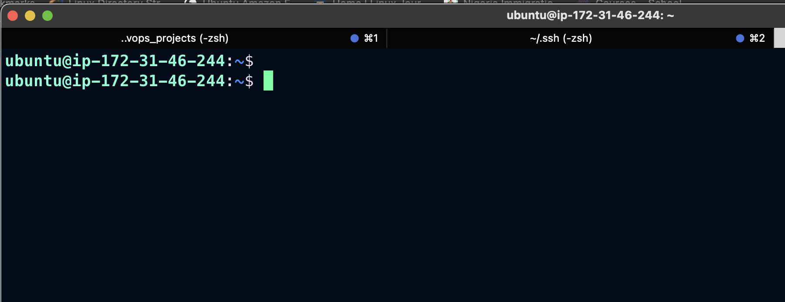

## Setting Up Apache Web Server

To deploy the web application, we need to install apache via ubuntu package manager `apt`:
```
# Updating Packages
sudo apt update

# Install apache
sudo apt install apache2 -y

```

To verify that apache2 is running as a Service in our OS, run the following command

```
sudo systemctl status apache2
```
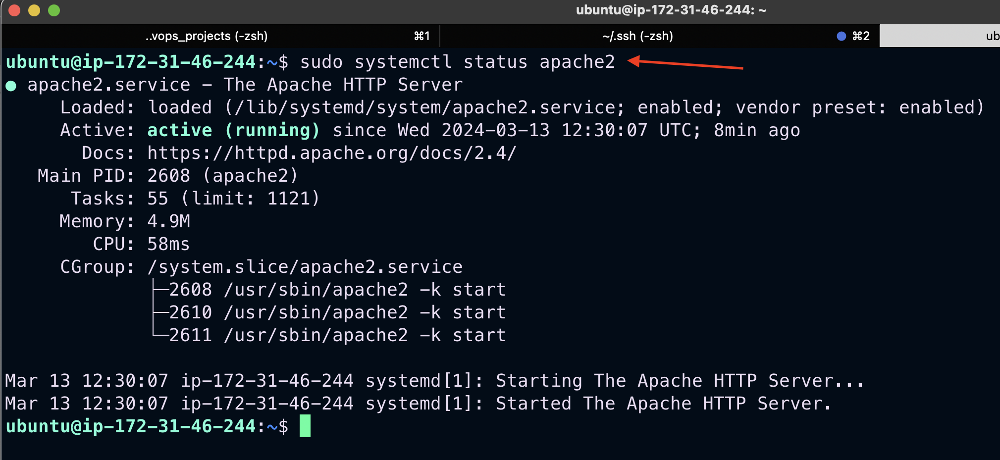

If it shows a green text, it means the web server has been successfully spunned and is live.

Run the below command to ensure apache2 starts automatically on system boot
```
sudo systemctl enable apache2
```
## Configuring Security Group Inbound Rules on EC2 Instance
A Security group is a group of rules that acts as a virtual firewall to the type of traffic that enters (inbound traffic) or leaves (outbound traffic) an instance.

When the instance is created, we have a default TCP rule on port 22 opened which is useful for SSH connection via a terminal.
In order to ensure that our webpage can be acccessed on the internet, we need to open a TCP port 80 inbound rule.

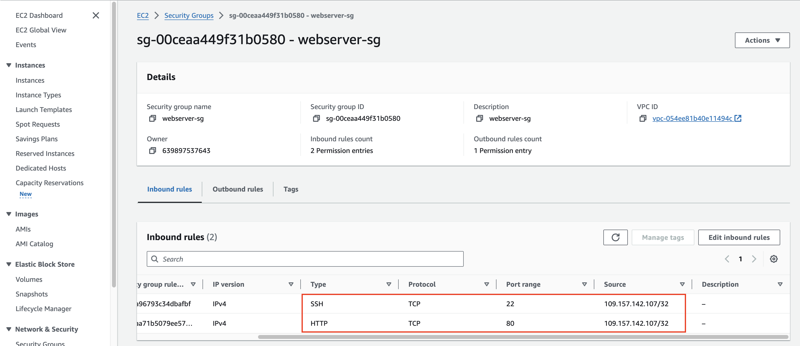

To check the accessiblity of our web server on the internet, we `curl` the IP address/DNS name of our localhost.
```
curl http://127.0.0.1:80  or curl http://localhost:80
```

To see if our web application server can respond to requests , use the public ip address of our instance on a web browser.
`http://<Public-IP-Address>:80` 
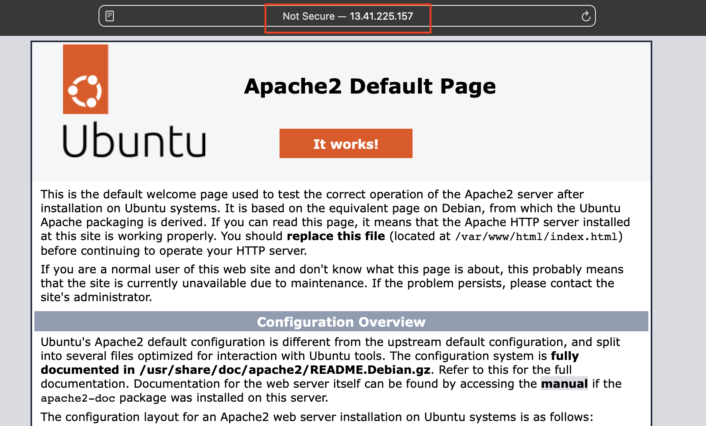

## Installing MySQL

We use MySQL as a relational database to store and manage data on our site. 

Install mysql using the command below

```
sudo apt install mysql-server -y
```  

On successful secure installation, run `sudo mysql`  on the terminal to have access to the MySQL DB.

```
sudo mysql
```
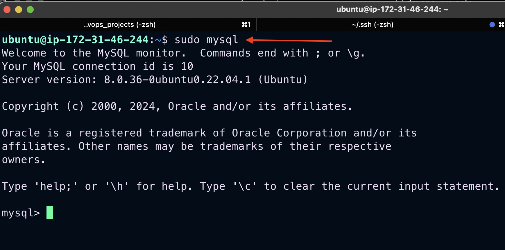

Before running the security script that comes pre-installed with MySQL to remove some insecure default settings and lock down access to your database system. Set a password for the `root` user, using `mysql_native_password` as default authentication method.

```
ALTER USER 'root'@'localhost' IDENTIFIED WITH mysql_native_password BY 'password1';
```

Use the `sudo mysql_secure_installation` command to remove insecure default settings and enable protection for the database.

```
sudo mysql_secure_installation
```
Exit from the MySQL terminal by typing `exit`.

Test ablility to log in to the MySQL console by typing:
```
sudo mysql -p
```

The -p flag in this command, which will prompt for the password used when changing the root user password.

Exit from the MySQL terminal by typing `exit`.

## Installing PHP and its Modules
PHP serves as a programming language which is useful for dynamically displaying contents of the webpage to users who make requests to the webserver.

We need to install `php` alongside its modules, `php-mysql` which is php module that allows php to communicate with the mysql database, `libapache2-mod-php` which ensures that the apache web server handles the php contents properly.

To install these 3 packages at once, run:
```
sudo apt install php php-mysql libapache2-mod-php -y
```
On successfull installation of php and its modules we can check the version to see if it was properly installed.

```
 php -v 
 ```

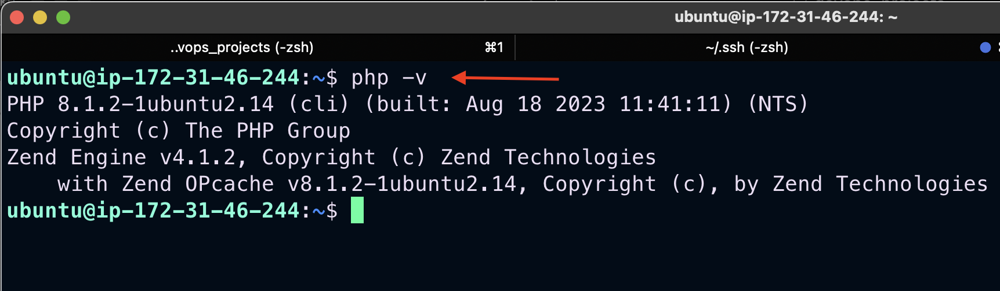


## Deploying Our Site on Apache's VirtualHost

Next we set up a virtual host using apache to enable us deploy our webcontent on the webserver. Apache's virtualhosting ensures that one or more websites can run on a webserver via different IP addresses.

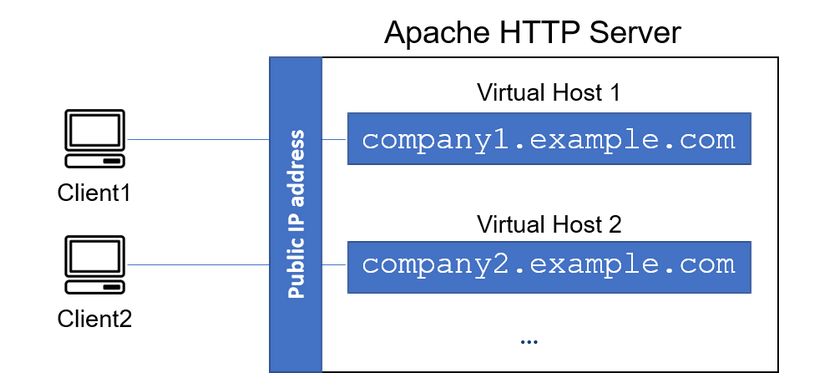

### Creating Web Domain For Our Site
Apache webserver serves a website by the way of server blocks inside its `/var/www/` directory, and it can support multiple of this server blocks to host other websites. 

Here we create a new directory called `projectlampstack` inside the `/var/www/` directory.

```
sudo mkdir /var/www/projectlampstack
```

Then we change permissions of the `projectlampstack` directory to the current user system

```
sudo chown -R $USER:$USER /var/www/projectlampstack
```
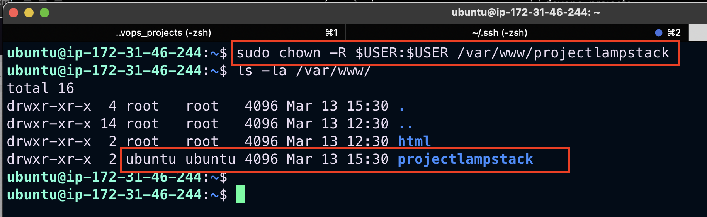

The `projectlampstack` directory represents the directory which will contain files related to our website as it represents a new server block on the apache webserver. In order to spin up this server block we need to configure it by creating a `.conf` file. 

```
sudo vi /etc/apache2/sites-available/projectlampstack.conf
```

Paste in the below
```
<VirtualHost *:80>
    ServerName projectlampstack
    ServerAlias www.projectlampstack
    ServerAdmin webmaster@localhoststack
    DocumentRoot /var/www/projectlampstack
    ErrorLog ${APACHE_LOG_DIR}/error.log
    CustomLog ${APACHE_LOG_DIR}/access.log combined
</VirtualHost>
```

Run `esc :wq ` to save and terminate vi editor.

Run `sudo a2ensite projectlampstack` to activate the server block. 

Run `sudo a2dissite 000-default` to deactivate the default webserver block that comes with apache on default.

To make sure your configuration file doesn’t contain syntax errors, run:

```
sudo apache2ctl configtest
```
This should return a `Syntax OK` response on the terminal

Reload the apache2 server 

```
sudo systemctl reload apache2
```
Create an index.html file inside the `/var/www/projectlampstack` 

```
sudo echo 'Hello LAMP from hostname' $(TOKEN=`curl -X PUT "http://169.254.169.254/latest/api/token" -H "X-aws-ec2-metadata-token-ttl-seconds: 21600"` \
&& curl -H "X-aws-ec2-metadata-token: $TOKEN" http://169.254.169.254/latest/meta-data/public-hostname) 'with public IP' $(curl -H "X-aws-ec2-metadata-token: $TOKEN" http://169.254.169.254/latest/meta-data/public-ipv4) > /var/www/projectlampstack/index.html
```

Go to the broswer and open the webpage
`http://<public_ip_address>:80`

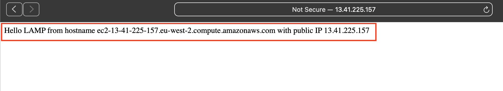

By default, the webserver has a preference for serving an index.html file based on the order of precedence by default in the DirectoryIndex settings of Apache.

To serve an index.php containing the server-side code, you’ll need to edit the `/etc/apache2/mods-enabled/dir.conf` file and change the order in which the index.php file is listed within the DirectoryIndex.

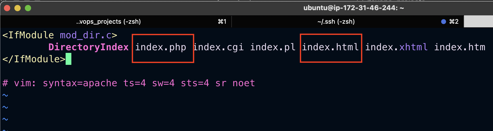

Run the `sudo systemctl reload apache2` to restart the apache2 web server for the changes made to the DirectoryIndex to take effect.

Create an `index.php` file in our webserver block and add the following code using the vim editor
```
sudo vim /var/www/projectlampstack/index.php
```
This will open a blank file. Add the following text, which is valid PHP code, inside the file:
 ```
 <?php
 phpinfo();
 ```

Input the instance public ip address on a web browser

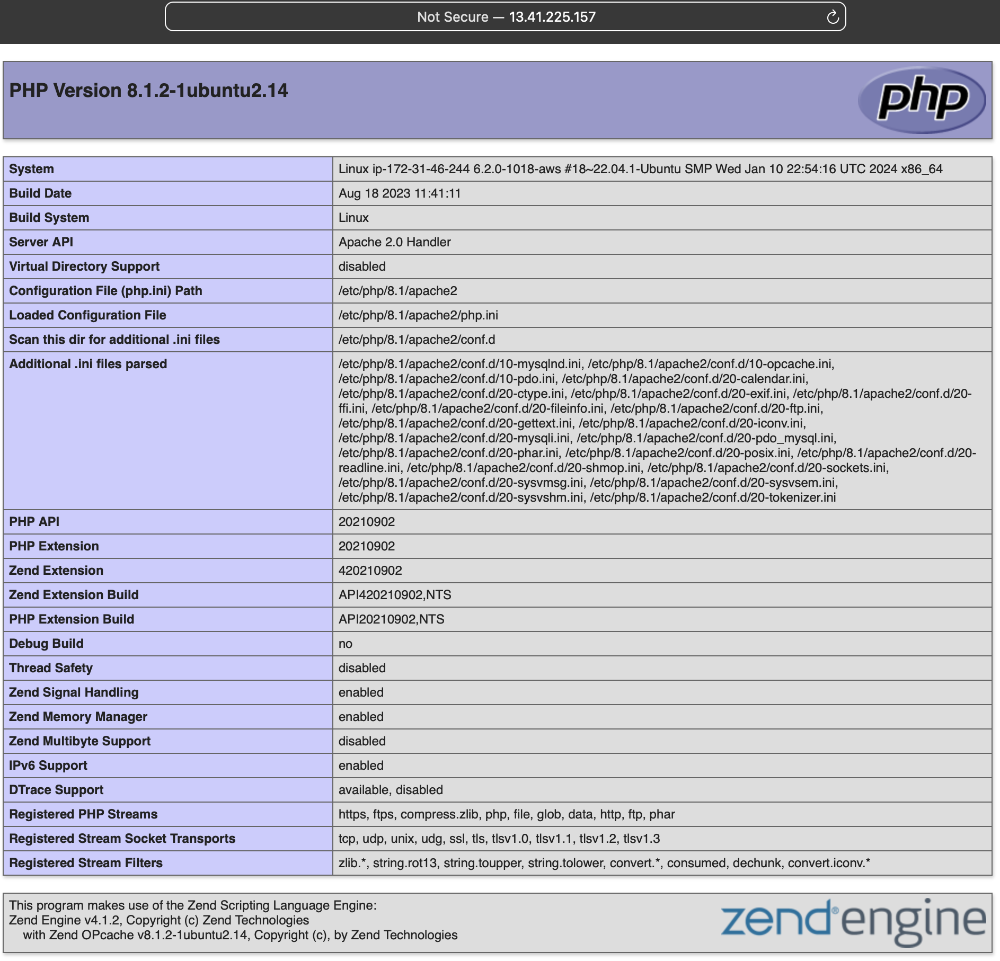