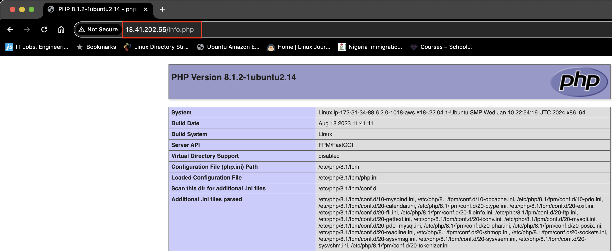

# Deploying a LEMP Stack Application On AWS Cloud

A LEMP Stack application is an application which as opposed to a [LAMP Stack Application](https://github.com/slimboi/devops_projects/blob/main/01.Deploying_A_LAMP_STACK_Application/README.md, 'My github article on LAMP Stack deployment') makes use of Nginx as the web server for hosting web applications. NGINX is an open source software for web serving, reverse proxying, caching, load balancing, media streaming, and more.

## Creating an Ubuntu EC2 Instance
Login to AWS Cloud Service console and create an Ubuntu EC2 instance. The virtual machine is a linux operating system which serves as the backbone for the LEMP Stack web application. 

Login into the instance via ssh:
```
ssh -i <private_keyfile.pem> username@ip-address
```

## Installing Nginx

To download package information from all configured sources, run:
```
sudo apt update
```
Run the below command to install Nginx
```
sudo apt install nginx -y
```
Spin up the nginx server and ensure it automatically starts on system reboot by running the following commands
```
sudo systemctl start nginx
sudo systemctl enable nginx
```
To check if the installation is succeessful, run:
```
systemctl status nginx
```
A green text color shows that the server is active.


To access the default nginx web server block to see if everything works correctly, `curl` the local IP address of our local machine which in most case is `127.0.0.1` or the DNS name `localhost` on any web browser on our local machine.

`curl http://127.0.0.1:80` or 
`curl http://localhost:80`

When we insert our public IP address on our browser, the nginx default webpage shows up showing that the webserver block is accessible from the internet via port 80 which was opened in our security group.


## Installing MySQL 

We have succeeded in setting up our nginx webserver and ensured its accessible over the internet. Next is to install MySQL which is a relational database management server to help store data and manage content on our web application.

Install mysql using the command below

```
sudo apt install mysql-server -y
```  

On successful secure installation, run `sudo mysql`  on the terminal to have access to the MySQL DB.

```
sudo mysql
```
Before running the security script that comes pre-installed with MySQL to remove some insecure default settings and lock down access to your database system. Set a password for the `root` user, using `mysql_native_password` as default authentication method.

```
ALTER USER 'root'@'localhost' IDENTIFIED WITH mysql_native_password BY 'password1';
```


Exit from the MySQL terminal by typing `exit`.

Use the `sudo mysql_secure_installation` command to remove insecure default settings and enable protection for the database.

```
sudo mysql_secure_installation
```
Exit from the MySQL terminal by typing `exit`.

## Installing PHP and its Modules
We use `PHP` to dynamically display contents of our webpage to users who make requests to the webserver.

While `Apache` embeds the PHP interpreter in each request, `Nginx` requires an external program to handle PHP processing and act as a bridge between the PHP interpreter itself and the web server. This allows for a better overall performance in most PHP-based websites, but it requires additional configuration. We need to install `php-fpm`, which stands for “PHP fastCGI process manager”, and tell Nginx to pass PHP requests to this software for processing. Additionally, we also need `php-mysql`, a PHP module that allows PHP to communicate with MySQL-based databases.

To install these 2 packages at once, run:
```
sudo apt install php-fpm php-mysql -y
```

## Creating a Web Server Block For our Web Application

To serve our webcontent on our webserver, we create a directory for our project inside the `/var/www/` directory. 

```
sudo mkdir /var/www/projectlemp
```
Then we change permissions of the `projectlemp` directory to the current system user

```
sudo chown -R $USER:$USER /var/www/projectlemp
```

Creating a configuration for our server block
```
sudo vi /etc/nginx/sites-available/projectlemp
```

The following snippets represents the configuration required for our web server block to be functional
```
#/etc/nginx/sites-available/projectlemp

server {
    listen 80;
    server_name projectlemp www.projectlemp;
    root /var/www/projectlemp;

    index index.html index.htm index.php;

    location / {
        try_files $uri $uri/ =404;
    }

    location ~ \.php$ {
        include snippets/fastcgi-php.conf;
        fastcgi_pass unix:/var/run/php/php8.1-fpm.sock;
     }

    location ~ /\.ht {
        deny all;
    }

}
```

We then link the configuration file to the sites-enabled directory

```
sudo ln -s /etc/nginx/sites-available/projectlemp /etc/nginx/sites-enabled
```

To test our configuration for errors we run
```
sudo nginx -t
```


Currently our new server block has been created and configured but currently the default server block is the default block that comes with nginx install. 

To unlink it run:

```
sudo unlink /etc/nginx/sites-enabled/default
```

We then reload nginx for all configurations to take effect 
```
sudo systemctl reload nginx
```

Create an index.html file inside `projectlemp` directory and write in contents to be accessed over the internet. 

Run the below command on the terminal:
```
TOKEN=`curl -X PUT "http://169.254.169.254/latest/api/token" -H "X-aws-ec2-metadata-token-ttl-seconds: 21600"`
```
Then echo the below into the `/var/www/projectlemp/index.html` file
```
sudo echo 'Hello LEMP from hostname' $(curl -H "X-aws-ec2-metadata-token: $TOKEN" http://169.254.169.254/latest/meta-data/public-hostname) 'with public IP' $(curl -H "X-aws-ec2-metadata-token: $TOKEN" http://169.254.169.254/latest/meta-data/public-ipv4) > /var/www/projectlemp/index.html
```

Paste public IP address on a browser to see content.

`http://<public-ip>:80`


## Serving PHP Using Nginx

Create an `info.php` file inside the `/var/www/projectlemp` directory.
```
sudo vi /var/www/projectlemp/info.php
```
This will open a blank file. Add the following text, which is a valid PHP code, inside the file:
 ```
 <?php
 phpinfo();
 ```

On a browser enter `http://<public-ip>/info.php`



Remove the file `index.php` file created as it contains sensitive information about the PHP environment and Ubuntu server. 

Run the below command to remove the file:
```
sudo rm /var/www/projectlemp/info.php
```

 ## Connecting PHP with MySQL and Fetching Content

 Login into our mysql-server 
 ```
 sudo mysql -p
 ```

 Create a new database 
 ```
 CREATE DATABASE tooling;
 ```

 Create a new user and assign user a password 
 ```
 CREATE USER 'tooling_user'@'%' IDENTIFIED WITH mysql_native_password BY 'password';
 ```

 Grant the user permission over the created database 
 ```
 GRANT ALL ON tooling.* TO 'tooling_user'@'%';
 ```

 `exit` from the mysql-server in which we are currently logged in as root user and then login into mysql server using the created user.
 
 ```
 mysql -u tooling_user -p
 ```
 
 
We create a table for the current user inside the `tooling` database and specify content parameters

```
CREATE TABLE tooling.todo_list(
    item_id INT AUTO_INCREMENT,
    content VARCHAR(255),
    PRIMARY KEY (item_id)
);
```

Insert a few rows of content in the `tooling` table. Repeat the command a few times, using different VALUES:
```
INSERT INTO tooling.todo_list(content) VALUES ("My first important item");
```


Create a php file `todo_list.php` in /var/www/projectlempstack directory and paste the following code

```
sudo vi /var/www/projectlemp/todo_list.php
```

```
<?php
$user = "tooling_user";
$password = "password";
$database = "tooling";
$table = "todo_list";

try {
  $db = new PDO("mysql:host=localhost;dbname=$database", $user, $password);
  echo "<h2>TODO</h2><ol>";
  foreach($db->query("SELECT content FROM $table") as $row) {
    echo "<li>" . $row['content'] . "</li>";
  }
  echo "</ol>";
} catch (PDOException $e) {
    print "Error!: " . $e->getMessage() . "<br/>";
    die();
}

```

We can then access our webpage via a browser
`http://<publicIP>/todo_list.php`

