# Deploying a MERN Stack Application on AWS Cloud

A `MERN` stack consists of a collection of technologies used for the development of web applications. It comprises of MongoDB, Express, React and Node which are all JavaScript technologies used for creating full-stack applications and dynamic websites.

**MongoDB**: is a document-oriented NoSQL database technology used in storing data in the form of documents.

**React**: a javascript library used for building interactive user interface based on components.

**Express**: its a web application framework of Node js which is used for building server-side part of an appication and also creating Restful APIs.

**Node**: Node.js is an open-source, cross-platform runtime environment for building fast and scalable server-side and networking applications.

We will be building a simple todo list application and deploying on AWS cloud EC2 machine.

## Creating an Ubuntu EC2 Instance
Login to AWS Cloud Service console and create an Ubuntu EC2 instance.

Login into the instance via ssh:
```
ssh -i <private_keyfile.pem> username@ip-address
```
## Configuring Backend

Update all default ubuntu dependencies to ensure compatibility during package installation.

Run:
```
sudo apt update
sudo apt upgrade -y
``` 

Next up will be to install nodejs, first we get the location of nodejs form the ubuntu repository using the following command.
```
curl -fsSL https://deb.nodesource.com/setup_21.x | sudo -E bash -
```
 
Then we run a node install
```
sudo apt-get install -y nodejs
```
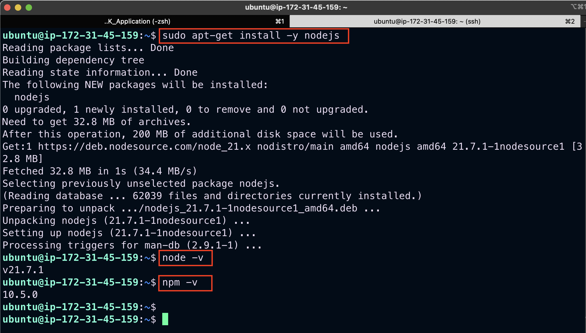

### **Setting up the application**
We then create a directory that will house our codes and packages and all subdirectories to represent components of our application.
```
mkdir todo
```
Inside this directory we will instantiate our project using `npm init`. This enables javascript to install packages useful for spinning up our application.
```
npm init
```

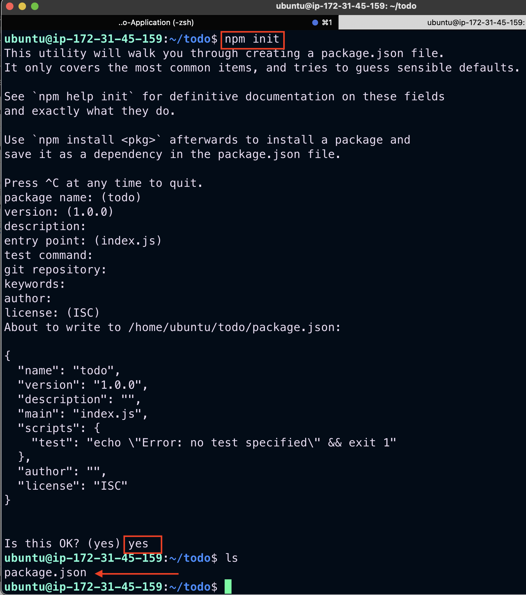

## Express installation
We will be installing express which is nodejs framework and will be helpful when creating routes for our application via HTTP requests.<br />
```
npm install express
```
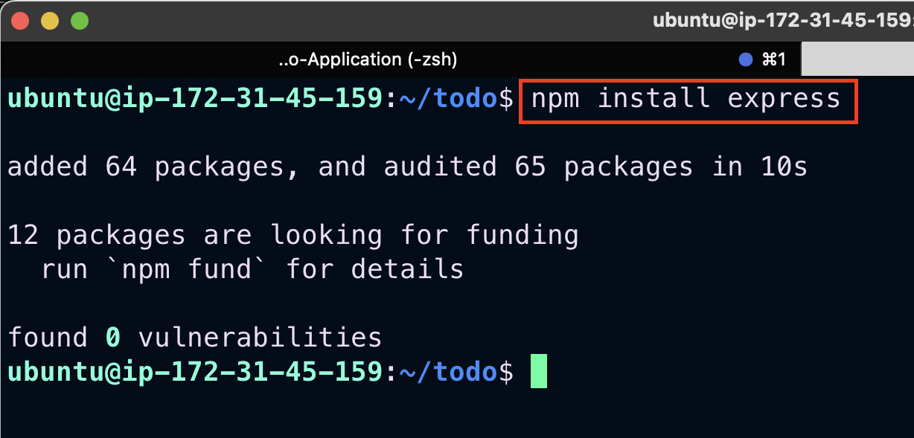

Create an `index.js` file which will contain code useful for spinning up our express server
```
touch index.js
```

Install the `dotenv` module which is a module that loads environment variables from a `.env` file into `process.env`. The `.env` files are useful for hiding important credentials which shouldnt be exposed.
```
npm install dotenv
```
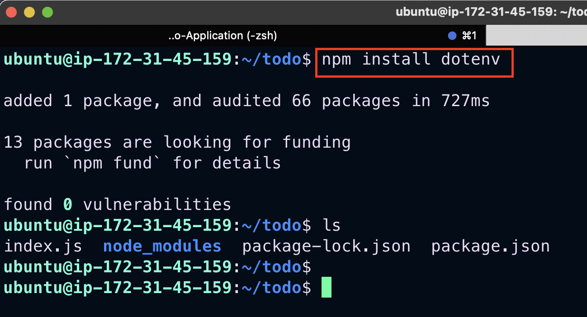

Open the `index.js` file 
```
vim index.js
```
Paste in the code below.
```
const express = require('express');
require('dotenv').config();

const app = express();

const port = process.env.PORT || 5000;

app.use((req, res, next) => {
res.header("Access-Control-Allow-Origin", "\*");
res.header("Access-Control-Allow-Headers", "Origin, X-Requested-With, Content-Type, Accept");
next();
});

app.use((req, res, next) => {
res.send('Welcome to Express');
});

app.listen(port, () => {
console.log(`Server running on port ${port}`)
});

```

To spin up our server, in the same directory as your `index.js` file, run: 
```
node index.js
```

This code is useful for spinning up our application via the port specified in the code.

Allow our port `(5000)` as part of the inbound rules for the security group attached to our EC2 instance to ensure that our server is accessible via the internet.

Paste our public ip address on the browser with the port to see if the server is properly configured.
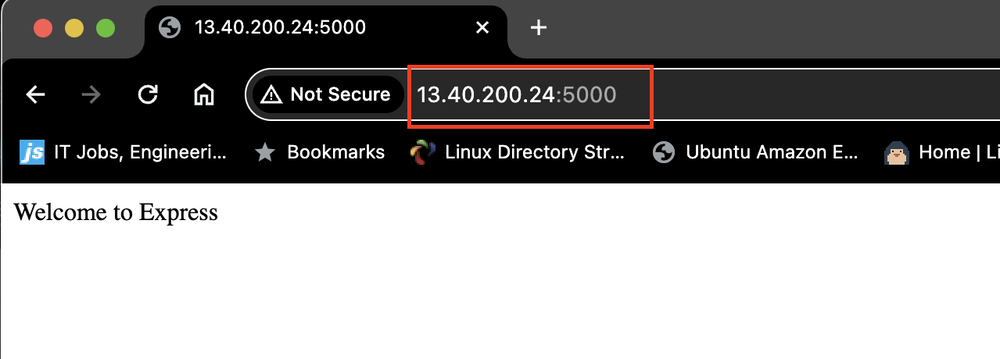

## Defining Routes For our Application
We will create a `routes` folder which will contain code pointing to the three main endpoints used in our todo application. 

There are three actions that our To-Do application needs to be able to do:

1. Create a new task
2. Display list of all tasks
3. Delete a completed task

Each task will be associated with some particular endpoint and will use different standard HTTP request methods: POST, GET, DELETE.

The `POST, GET, DELETE` requests will be helpful in interacting with our client_side and database via restful apis.

```
mkdir routes
cd routes
```
Create a `api.js` file
```
vim api.js
```
Paste the code below in `api.js` file. It is an example of a simple route that fires various endpoints. 

```
const express = require ('express');
const router = express.Router();

router.get('/todos', (req, res, next) => {

});

router.post('/todos', (req, res, next) => {

});

router.delete('/todos/:id', (req, res, next) => {

})

module.exports = router;
```

## Creating models
We will be creating the models directory which will be used to define our database schema. A `schema` is a blueprint of how our database will be structured which include other fields which may not be required to be stored in the database. These are known as *virtual properties*.

To create a `schema` and a `model`, install `mongoose` which is a Node.js package that makes working with mongodb easier.

Switch to `todo` directory, and run:
```
npm install mongoose
```


Create a `models` directory, and then create a `todo.js` file in it .
```
mkdir models && cd models && touch todo.js
```
Open the `todo.js` file
```
vim todo.js
```
Paste the code below inside the `todo.js` file
```
const mongoose = require('mongoose');
const Schema = mongoose.Schema;

//create schema for todo
const TodoSchema = new Schema({
action: {
type: String,
required: [true, 'The todo text field is required']
}
})

//create model for todo
const Todo = mongoose.model('todo', TodoSchema);

module.exports = Todo;
```

Since we have defined a schema for how our database should be structured, we then update the code in our `api.js` to fire specific actions when an endpoint is called.

In `routes` directory open `api.js`, and delete the code inside with :%d command
```
vim api.js
```
Then paste the code below into it
```
const express = require ('express');
const router = express.Router();
const Todo = require('../models/todo');

router.get('/todos', (req, res, next) => {

//this will return all the data, exposing only the id and action field to the client
Todo.find({}, 'action')
.then(data => res.json(data))
.catch(next)
});

router.post('/todos', (req, res, next) => {
if(req.body.action){
Todo.create(req.body)
.then(data => res.json(data))
.catch(next)
}else {
res.json({
error: "The input field is empty"
})
}
});

router.delete('/todos/:id', (req, res, next) => {
Todo.findOneAndDelete({"_id": req.params.id})
.then(data => res.json(data))
.catch(next)
})

module.exports = router;
```

## Creating a MongoDB Database
We will need a database to store all information when we make a `post` request to an endpoint. We will be using mLab which provides a DBaaS (Database as a service) solution.

- Login into mLab and create a cluster

- Create a database and a collection 

To connect mongoose(application_db) to our database service we connect to it using the connection credential provided by mLab

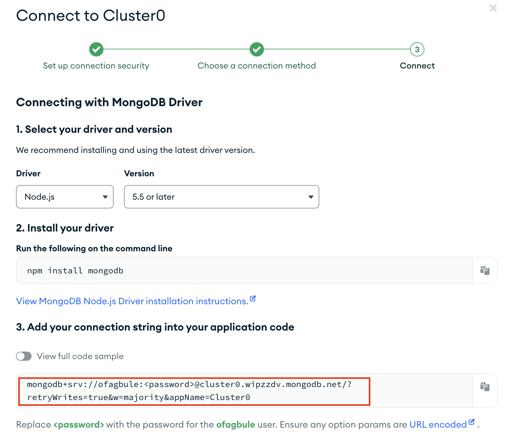

Copy the connection code and save it inside a `.env` file which should be created in the parent `todo` directory

`DB = "mongodb+srv://<username>:<password>@<network-address>/<dbname>?retryWrites=true&w=majority"`

Change the username, password,database name and network address to the one specified by you when creating the database and collection.

Update the code in our `index.js` as we need to point mongoose to the database service we created using mLab

```
const express = require('express');
const bodyParser = require('body-parser');
const mongoose = require('mongoose');
const routes = require('./routes/api');
const path = require('path');
require('dotenv').config();

const app = express();

const port = process.env.PORT || 5000;

//connect to the database
mongoose.connect(process.env.DB, { useNewUrlParser: true, useUnifiedTopology: true })
.then(() => console.log(`Database connected successfully`))
.catch(err => console.log(err));

//since mongoose promise is depreciated, we overide it with node's promise
mongoose.Promise = global.Promise;

app.use((req, res, next) => {
res.header("Access-Control-Allow-Origin", "\*");
res.header("Access-Control-Allow-Headers", "Origin, X-Requested-With, Content-Type, Accept");
next();
});

app.use(bodyParser.json());

app.use('/api', routes);

app.use((err, req, res, next) => {
console.log(err);
next();
});

app.listen(port, () => {
console.log(`Server running on port ${port}`)
});
```

Then we run `node index.js` to test our connection.

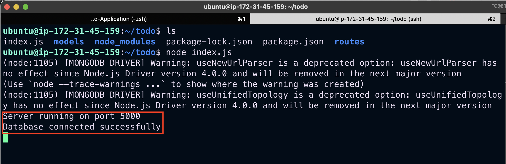

## Testing Backend Code Using Postman
So far, we have built the backend of our application and in order to test to see if it works without a frontend, we use postman to test the endpoints.

On Postman, we make a POST request to our database whilst specifying an action in the body of the request.

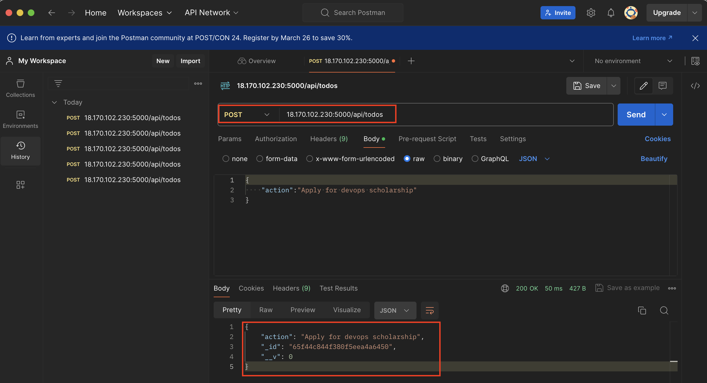

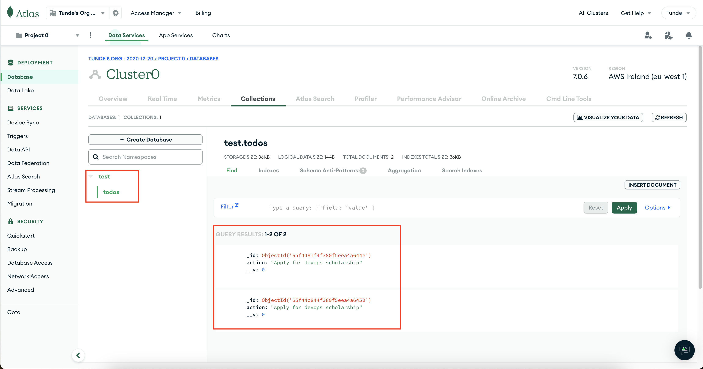

Then We make a GET request to see if we can get back what has been posted into the database.

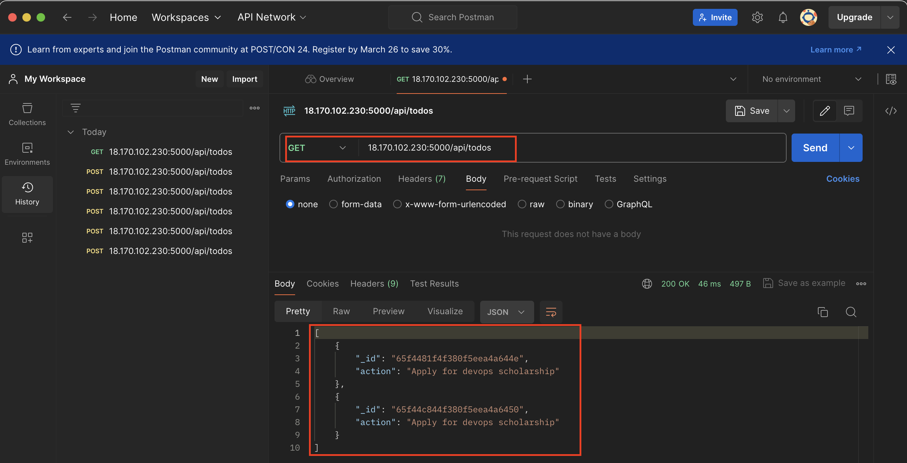

We can also make a delete request which deletes and entry using the id of each entry.

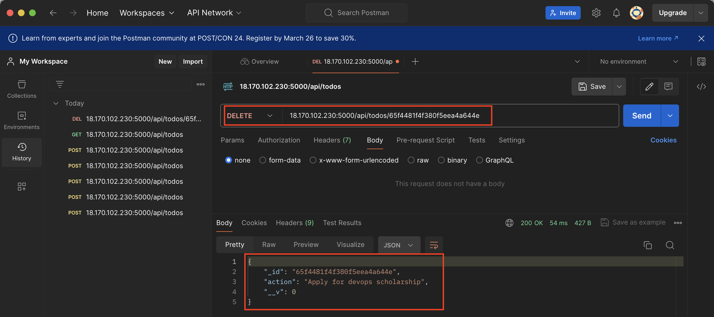

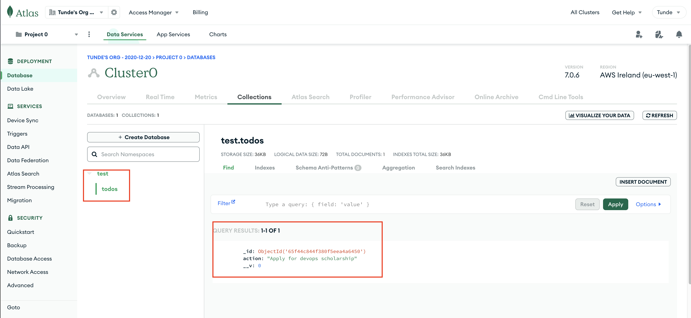

## Creating Frontend
Now we create a user interface for a Web client (browser) to interact with the application via API.

In the `todo` directory which is same directory containing the backend code, run:
```
npx create-react-app client
```
This creates a `client` directory containing the necessary packages required for react to function.

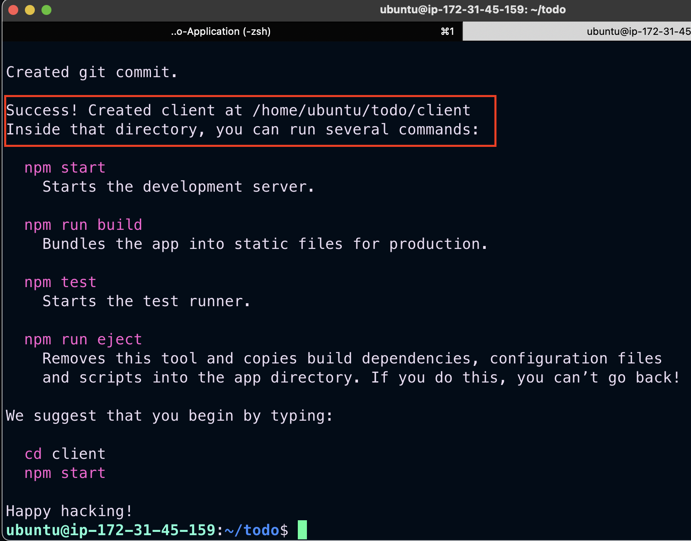

*I faced a challenge here with the memory of `t2.micro` instance. Stopped the instance and changed instance type to `t2.medium` before the installation could be completed.*

Before testing the react app, there are some dependencies that need to be installed.

Install `concurrently` which is used to run more than one command simultaneously from the same terminal window.
```
npm install concurrently --save-dev
```
Install `nodemon` which is used to `run and monitor the server`. If there is any change in the server code, nodemon will restart it automatically and load the new changes.
```
npm install nodemon --save-dev
```

We configure package.json to run the new installation

In `todo` folder open the `package.json` file. Change the highlighted part of the below screenshot and replace with the code below.
```
"scripts": {
"start": "node index.js",
"start-watch": "nodemon index.js",
"dev": "concurrently \"npm run start-watch\" \"cd client && npm start\""
},
```
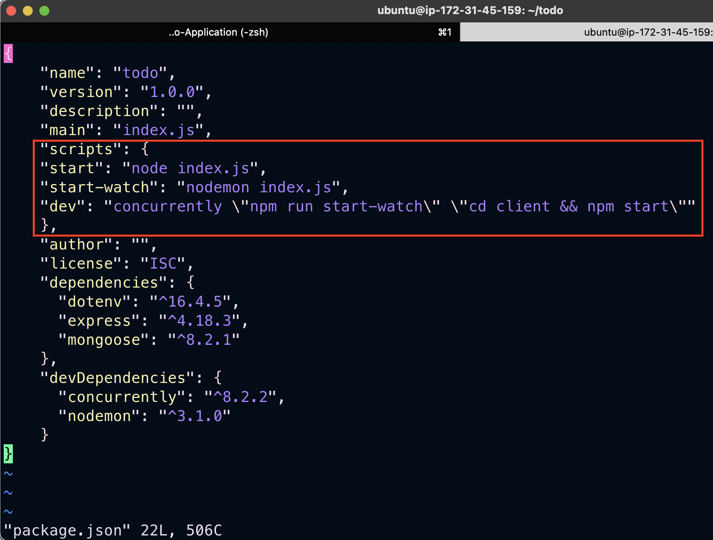

In `client` directory, configure *proxy* in `package.json` to ensure we can access our site via using `http://localhost:5000` rather than always including the entire path like `http://localhost:5000/api/todos`.

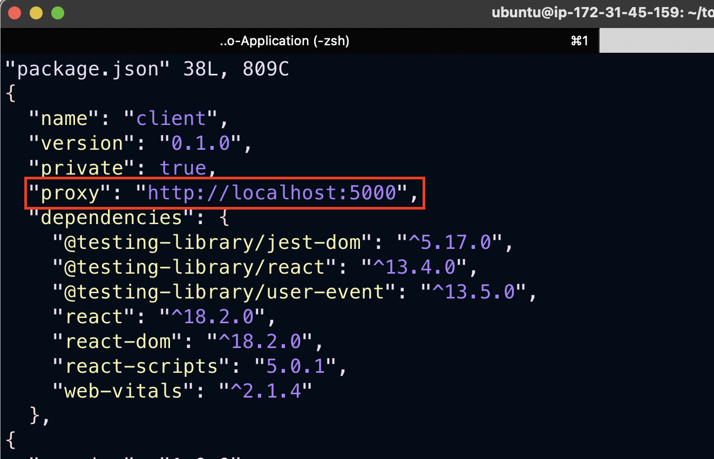

Inside `todo` directory, run:
```
npm run dev
```
App should open and be running on port `localhost:3000`.

Then we allow port 3000 in inbound rules for our security group.

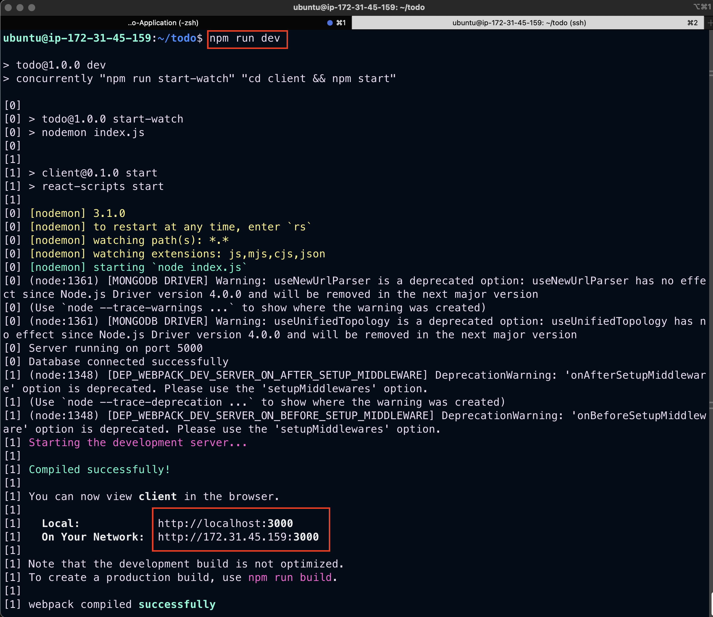

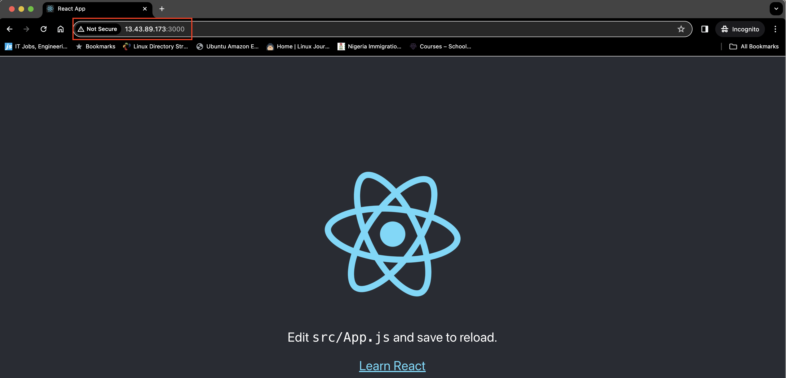

We now move into the `client` then `src` directory and then create a `components` directory which will contain files that contains our frontend code. Inside the `components` directory we create `Input.js ListTodo.js Todo.js`.
```
mkdir component && cd component
touch Input.js ListTodo.js Todo.js
```

Insert the below code into the `Input.js` file.
```
import React, { Component } from 'react';
import axios from 'axios';

class Input extends Component {

state = {
action: ""
}

addTodo = () => {
const task = {action: this.state.action}

    if(task.action && task.action.length > 0){
      axios.post('/api/todos', task)
        .then(res => {
          if(res.data){
            this.props.getTodos();
            this.setState({action: ""})
          }
        })
        .catch(err => console.log(err))
    }else {
      console.log('input field required')
    }

}

handleChange = (e) => {
this.setState({
action: e.target.value
})
}

render() {
let { action } = this.state;
return (
<div>
<input type="text" onChange={this.handleChange} value={action} />
<button onClick={this.addTodo}>add todo</button>
</div>
)
}
}

export default Input
```

Ensure `axios` which is a Promise based HTTP client for the browser and node.js is installed in the `client` directory

```
npm install axios
```

In the `ListTodo.js` file inside `components` directory, insert the following code
```
import React from 'react';

const ListTodo = ({ todos, deleteTodo }) => {

return (
<ul>
{
todos &&
todos.length > 0 ?
(
todos.map(todo => {
return (
<li key={todo._id} onClick={() => deleteTodo(todo._id)}>{todo.action}</li>
)
})
)
:
(
<li>No todo(s) left</li>
)
}
</ul>
)
}

export default ListTodo
```

In the `Todo.js` file inside `components` directory, insert the following code
```
import React, {Component} from 'react';
import axios from 'axios';

import Input from './Input';
import ListTodo from './ListTodo';

class Todo extends Component {

state = {
todos: []
}

componentDidMount(){
this.getTodos();
}

getTodos = () => {
axios.get('/api/todos')
.then(res => {
if(res.data){
this.setState({
todos: res.data
})
}
})
.catch(err => console.log(err))
}

deleteTodo = (id) => {

    axios.delete(`/api/todos/${id}`)
      .then(res => {
        if(res.data){
          this.getTodos()
        }
      })
      .catch(err => console.log(err))

}

render() {
let { todos } = this.state;

    return(
      <div>
        <h1>My Todo(s)</h1>
        <Input getTodos={this.getTodos}/>
        <ListTodo todos={todos} deleteTodo={this.deleteTodo}/>
      </div>
    )

}
}

export default Todo;
```

In the `src` folder , edit the `App.js` file which encapsulates all other components. 

Paste the below code
```
import React from 'react';

import Todo from './components/Todo';
import './App.css';

const App = () => {
return (
<div className="App">
<Todo />
</div>
);
}

export default App;
```

In same directory, edit the `App.css` file and insert the following code
```
.App {
text-align: center;
font-size: calc(10px + 2vmin);
width: 60%;
margin-left: auto;
margin-right: auto;
}

input {
height: 40px;
width: 50%;
border: none;
border-bottom: 2px #101113 solid;
background: none;
font-size: 1.5rem;
color: #787a80;
}

input:focus {
outline: none;
}

button {
width: 25%;
height: 45px;
border: none;
margin-left: 10px;
font-size: 25px;
background: #101113;
border-radius: 5px;
color: #787a80;
cursor: pointer;
}

button:focus {
outline: none;
}

ul {
list-style: none;
text-align: left;
padding: 15px;
background: #171a1f;
border-radius: 5px;
}

li {
padding: 15px;
font-size: 1.5rem;
margin-bottom: 15px;
background: #282c34;
border-radius: 5px;
overflow-wrap: break-word;
cursor: pointer;
}

@media only screen and (min-width: 300px) {
.App {
width: 80%;
}

input {
width: 100%
}

button {
width: 100%;
margin-top: 15px;
margin-left: 0;
}
}

@media only screen and (min-width: 640px) {
.App {
width: 60%;
}

input {
width: 50%;
}

button {
width: 30%;
margin-left: 10px;
margin-top: 0;
}
}
```

Edit the `index.css` file and insert the below code
```
body {
margin: 0;
padding: 0;
font-family: -apple-system, BlinkMacSystemFont, "Segoe UI", "Roboto", "Oxygen",
"Ubuntu", "Cantarell", "Fira Sans", "Droid Sans", "Helvetica Neue",
sans-serif;
-webkit-font-smoothing: antialiased;
-moz-osx-font-smoothing: grayscale;
box-sizing: border-box;
background-color: #282c34;
color: #787a80;
}

code {
font-family: source-code-pro, Menlo, Monaco, Consolas, "Courier New",
monospace;
}
```

Lastly go into the root directory `todo` and run 
```
npm run dev
``` 

This builds up the application and spins it up.

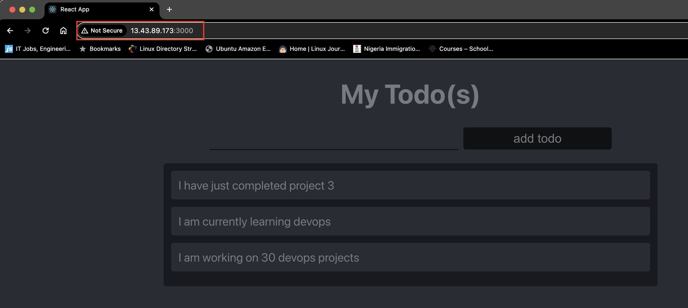
