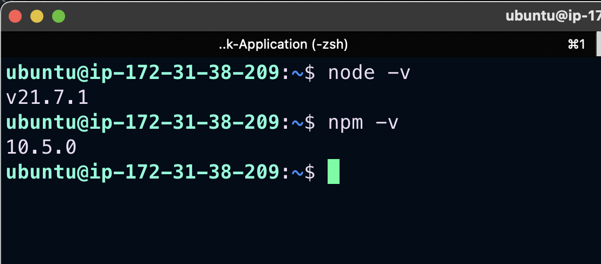
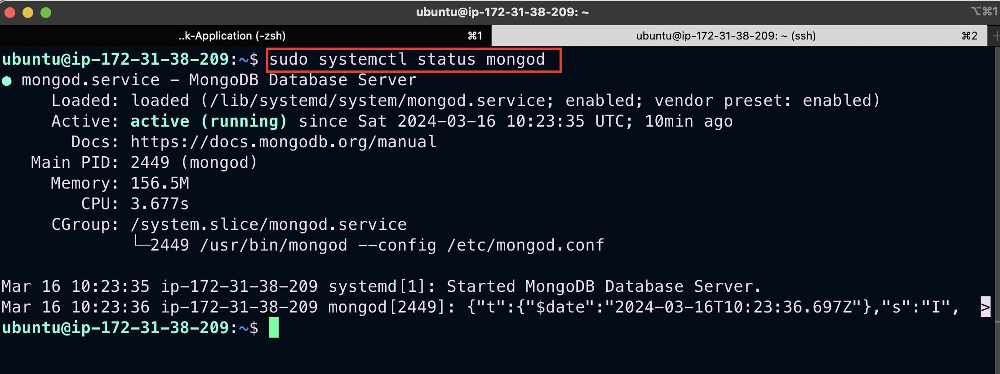
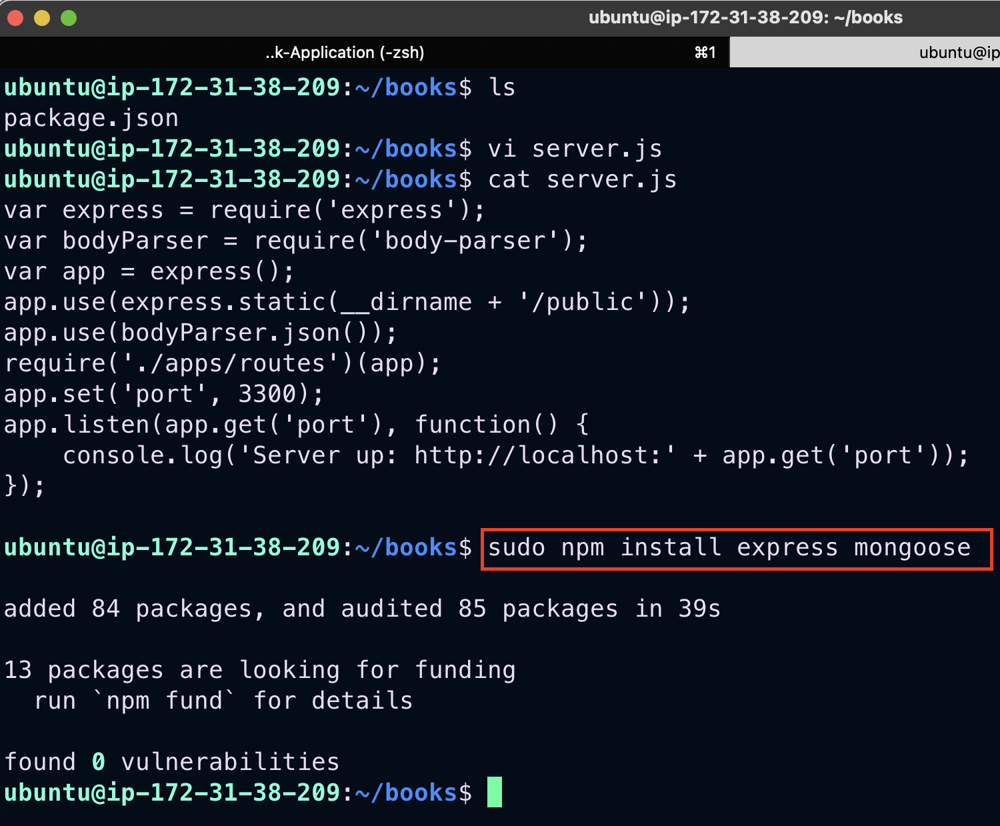
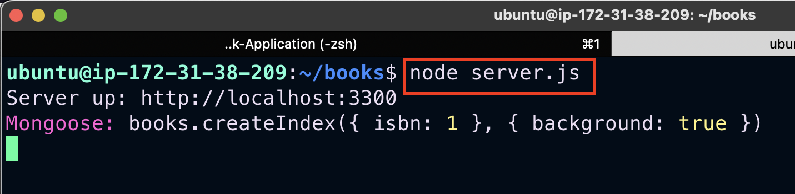
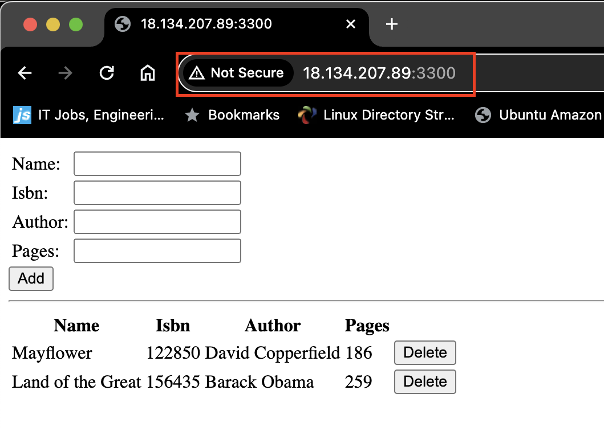

# Deploying a MEAN Stack Application on AWS Cloud

MEAN Stack is a combination of following components:

1. MongoDB (Document database) - Stores and allows to retrieve data.

2. Express (Back-end application framework) - Makes requests to Database for Reads and Writes.

3. Angular (Front-end application framework) - Handles Client and Server Requests

4. Node.js (JavaScript runtime environment) - Accepts requests and displays results to end user

First we create an aws EC2 instance, named `project mean`. This will serve as the backbone of our application deployment.

We then update and upgrade core dependencies on our linux backbone
```
sudo apt update && sudo apt upgrade -y
```

Install nodejs and add certificates
```
sudo apt -y install curl dirmngr apt-transport-https lsb-release ca-certificates

curl -fsSL https://deb.nodesource.com/setup_21.x | sudo -E bash -

sudo apt install -y nodejs
```


### Install MongoDB

We then proceed to install mongodb which is a non-relational database which we will use to store our applications data.

MongoDB stores data in flexible, `JSON-like` documents. Fields in a database can vary from document to document and data structure can be changed over time. For our example application, we are adding book records to MongoDB that contain book name, isbn number, author, and number of pages.

Import the Public Key used by Package Management System
```
sudo apt-get install gnupg curl

curl -fsSL https://www.mongodb.org/static/pgp/server-7.0.asc | \
   sudo gpg -o /usr/share/keyrings/mongodb-server-7.0.gpg \
   --dearmor
```

Create a List file For MongoDB
```
echo "deb [ arch=amd64,arm64 signed-by=/usr/share/keyrings/mongodb-server-7.0.gpg ] https://repo.mongodb.org/apt/ubuntu jammy/mongodb-org/7.0 multiverse" | sudo tee /etc/apt/sources.list.d/mongodb-org-7.0.list
```
Reload local package database
```
sudo apt update
```
Install MongoDB
```
sudo apt install -y mongodb-org
```
Start and Enable The Mongod Service
```
sudo systemctl start mongod
sudo systemctl enable mongod
```
Verify that the service is up and running
```
sudo systemctl status mongod
```


Install npm which is the default package manager for JavaScript's runtime Node.js.


Install `body-parser`. 

We need **body-parser** package to help us process JSON files passed in requests to the server.
```
sudo npm install body-parser
```

We create a `Books` directory and we initialize it as a `npm` project using `npm init`. 
```
mkdir books && cd books
npm init
```

Then create a `server.js` file and paste in the code below to setup the server.
```
var express = require('express');
var bodyParser = require('body-parser');
var app = express();
app.use(express.static(__dirname + '/public'));
app.use(bodyParser.json());
require('./apps/routes')(app);
app.set('port', 3300);
app.listen(app.get('port'), function() {
    console.log('Server up: http://localhost:' + app.get('port'));
});
```
### Install Express and set up routes to the server

Express is a minimal and flexible `Node.js` web application framework that provides features for web and mobile applications. We will use `Express` in to pass book information to and from our MongoDB database.

We also will use `Mongoose` package which provides a straight-forward, schema-based solution to model your application data. We will use Mongoose to establish a schema for the database to store data of our book register.

Installing express and mongoose provides a straight-forward, schema-based solution to model application data. We will use Mongoose to establish a schema for the database to store `data` of our book register.
```
sudo npm install express mongoose
```



In the `books` directory create a directory `apps`. 

Inside `apps` directory, create a `routes.js` file then append the code below to it
```
const Book = require('./models/book');

module.exports = function(app) {
  app.get('/book', function(req, res) {
    Book.find({}).then(result => {
      res.json(result);
    }).catch(err => {
      console.error(err);
      res.status(500).send('An error occurred while retrieving books');
    });
  });

  app.post('/book', function(req, res) {
    const book = new Book({
      name: req.body.name,
      isbn: req.body.isbn,
      author: req.body.author,
      pages: req.body.pages
    });
    book.save().then(result => {
      res.json({
        message: "Successfully added book",
        book: result
      });
    }).catch(err => {
      console.error(err);
      res.status(500).send('An error occurred while saving the book');
    });
  });

  app.delete("/book/:isbn", function(req, res) {
    Book.findOneAndRemove(req.query).then(result => {
      res.json({
        message: "Successfully deleted the book",
        book: result
      });
    }).catch(err => {
      console.error(err);
      res.status(500).send('An error occurred while deleting the book');
    });
  });

  const path = require('path');
  app.get('*', function(req, res) {
    res.sendFile(path.join(__dirname, 'public', 'index.html'));
  });
};
```

Create a direcotry `models` in the `apps` directory.

Create a `books.js` file inside `models` and append the code below which contains the schema model
```
var mongoose = require('mongoose');
var dbHost = 'mongodb://localhost:27017/test';
mongoose.connect(dbHost);
mongoose.connection;
mongoose.set('debug', true);
var bookSchema = mongoose.Schema( {
  name: String,
  isbn: {type: String, index: true},
  author: String,
  pages: Number
});
var Book = mongoose.model('Book', bookSchema);
module.exports = mongoose.model('Book', bookSchema);
```
### Access the routes with `AngularJS`
AngularJS provides a web framework for creating dynamic views in your web applications. In this tutorial, we use AngularJS to connect our web page with Express and perform actions on our book register.

In `book` directory create a `public` directory.

In `public` directory, create a `script.js` file and append the code below. It will contain our angular frontend code.
```
var app = angular.module('myApp', []);
app.controller('myCtrl', function($scope, $http) {
  $http( {
    method: 'GET',
    url: '/book'
  }).then(function successCallback(response) {
    $scope.books = response.data;
  }, function errorCallback(response) {
    console.log('Error: ' + response);
  });
  $scope.del_book = function(book) {
    $http( {
      method: 'DELETE',
      url: '/book/:isbn',
      params: {'isbn': book.isbn}
    }).then(function successCallback(response) {
      console.log(response);
    }, function errorCallback(response) {
      console.log('Error: ' + response);
    });
  };
  $scope.add_book = function() {
    var body = '{ "name": "' + $scope.Name + 
    '", "isbn": "' + $scope.Isbn +
    '", "author": "' + $scope.Author + 
    '", "pages": "' + $scope.Pages + '" }';
    $http({
      method: 'POST',
      url: '/book',
      data: body
    }).then(function successCallback(response) {
      console.log(response);
    }, function errorCallback(response) {
      console.log('Error: ' + response);
    });
  };
});
```

Create a `index.html` in the `public` directory and append the code below.
```
<!doctype html>
<html ng-app="myApp" ng-controller="myCtrl">
  <head>
    <script src="https://ajax.googleapis.com/ajax/libs/angularjs/1.6.4/angular.min.js"></script>
    <script src="script.js"></script>
  </head>
  <body>
    <div>
      <table>
        <tr>
          <td>Name:</td>
          <td><input type="text" ng-model="Name"></td>
        </tr>
        <tr>
          <td>Isbn:</td>
          <td><input type="text" ng-model="Isbn"></td>
        </tr>
        <tr>
          <td>Author:</td>
          <td><input type="text" ng-model="Author"></td>
        </tr>
        <tr>
          <td>Pages:</td>
          <td><input type="number" ng-model="Pages"></td>
        </tr>
      </table>
      <button ng-click="add_book()">Add</button>
    </div>
    <hr>
    <div>
      <table>
        <tr>
          <th>Name</th>
          <th>Isbn</th>
          <th>Author</th>
          <th>Pages</th>

        </tr>
        <tr ng-repeat="book in books">
          <td>{{book.name}}</td>
          <td>{{book.isbn}}</td>
          <td>{{book.author}}</td>
          <td>{{book.pages}}</td>

          <td><input type="button" value="Delete" data-ng-click="del_book(book)"></td>
        </tr>
      </table>
    </div>
  </body>
</html>
```

We move into the `books` directory and spin up the express server. Run:
```
node server.js
```



On a browser, paste the public ip address of our instance to view the site

