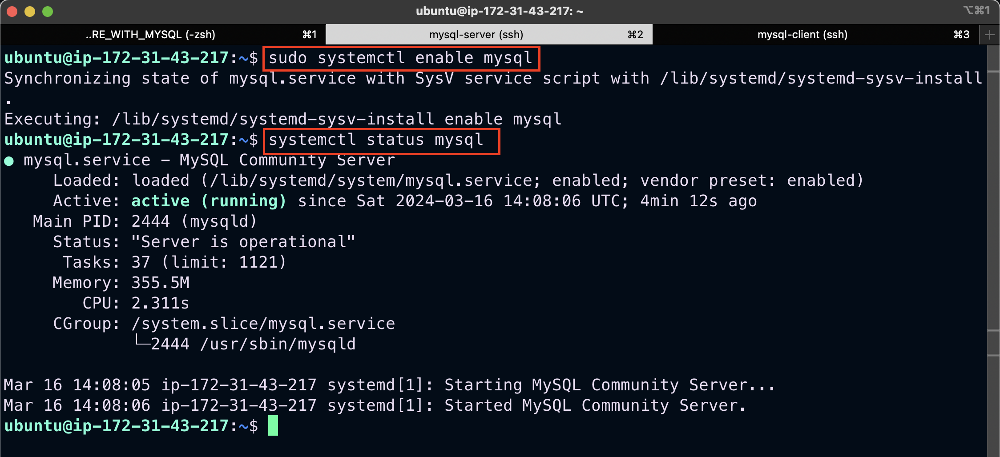
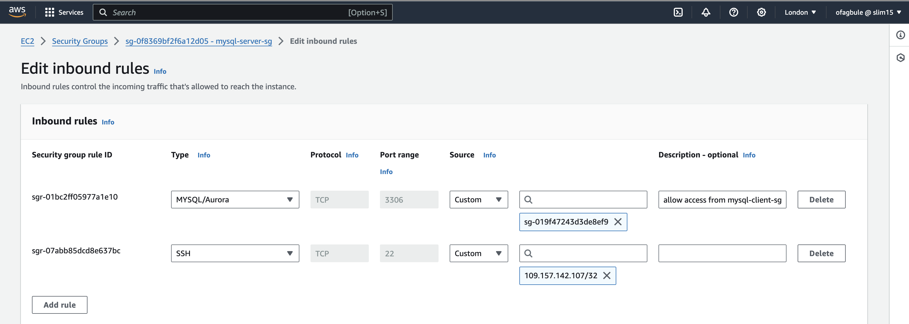
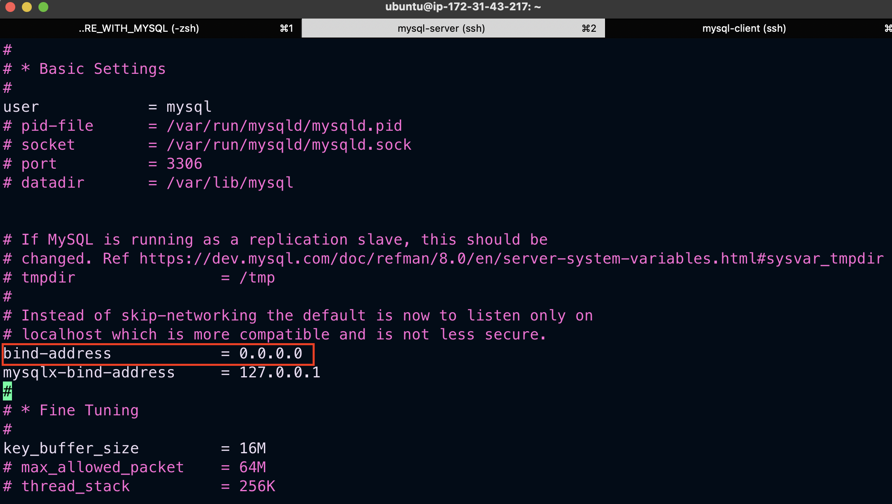
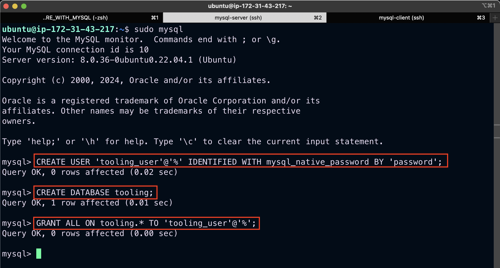
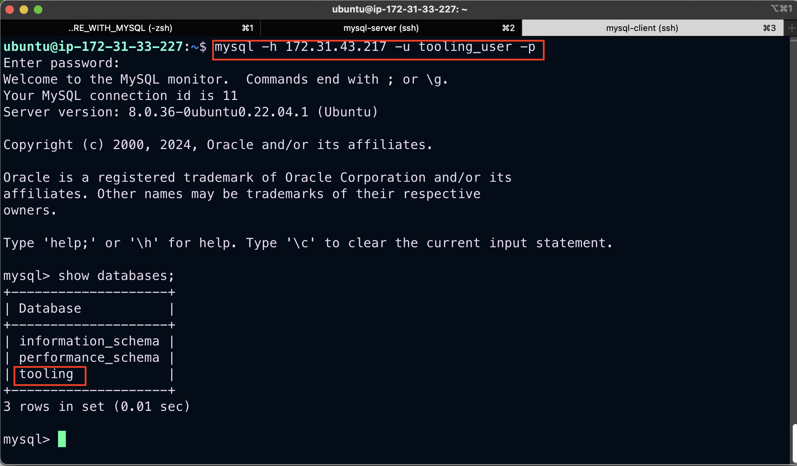

# Implementing a Client Server Architecture Using MySQL server and MYSQL client

## Project Architecture


To demonstrate Client-Server architecture we will be using two Ubuntu 22.04 Ec2 instances in AWS
```
Server A name - `mysql-server`
Server B name - `mysql-client`
```

On `mysql-server` linux server install MySQL server software.
```
sudo apt update && sudo apt install mysql-server -y
```

Enable MySQL service
```
sudo systemctl enable mysql
```
Verify MySQL is running and accepting connections
```
systemctl status mysql
```


On `mysql-client` linux server install MySQL client software.
```
sudo apt update && sudo apt-get install mysql-client -y
```

Open port 3306 on `mysql-server` security group to allow for connection. Both server can communicate using private IPs since they belong to the same subnet



Change the `bind-address` on `mysql-server` to allow for connection from any IP address. Set the bind-address to `0.0.0.0` using the command below:
```
sudo vi /etc/mysql/mysql.conf.d/mysqld.cnf
```


Configure MysQL server
```
sudo mysql_secure_installation
```

Create a user
```
CREATE USER 'tooling_user'@'%' IDENTIFIED WITH mysql_native_password BY 'password';
```

Create database
```
CREATE DATABASE tooling;
```

- Grant all permission on database
```
GRANT ALL ON tooling.* TO 'tooling_user'@'%';
```


From `mysql-client` linux server connect remotely to `mysql-server` database engine without using SSH. You must use the mysql utility to perform this action.
```
mysql -h <private-ip-address of the database server> -u tooling_user -p
```
Check that you have successfully connected to a remote MySQL server and can perform SQL queries. You should something similar to the screenshot below.

