# Implementing-Wordpress-Web-Solution

## STEP 1 Preparing Web Server
- Create a EC2 instance server on AWS 

- On the EBS console, create 3 storage volumes for the instance. This serves as additional external storage to our EC2 machine

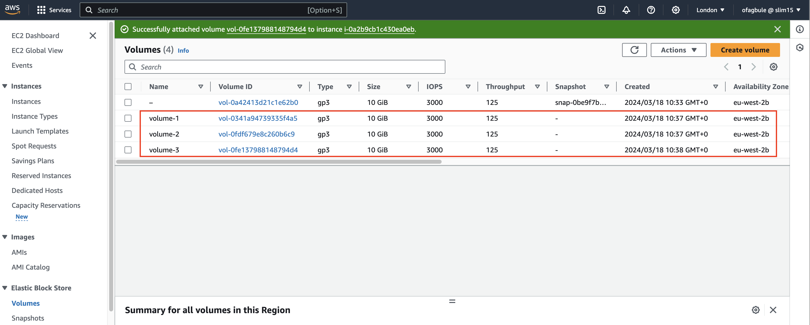

- Attach the created volumes to the EC2 instance 

- SSH into the instance and on terminal, view the disks attached to the instance. This is achieved using the `lsblk` command.

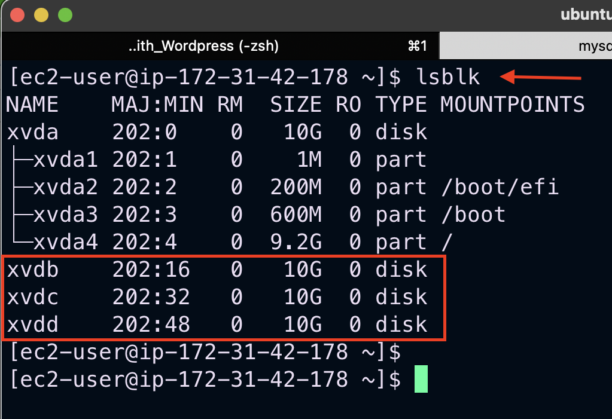

- All devices in Linux reside in `/dev/` directory. Inspect it with `ls /dev/` and make sure you see all 3 newly created block devices there.

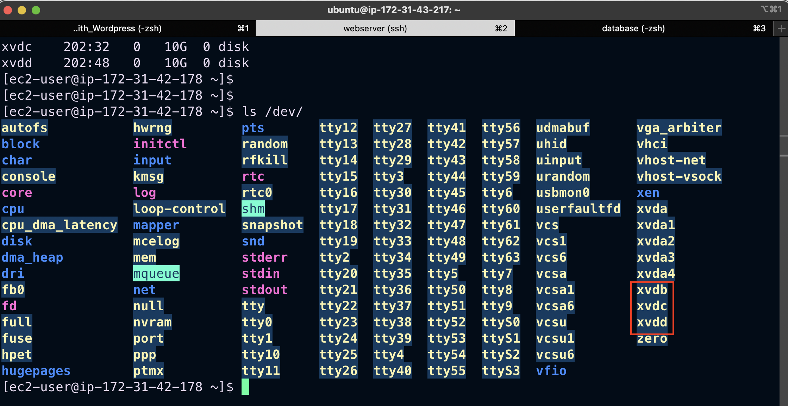

- To see all mounts and free spaces on our server, use `df-h`

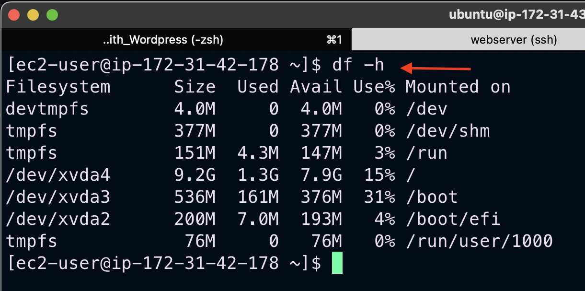

- Create single partitions on each volume on the server using `gdisk `
```
sudo gdisk /dev/xvdb
```

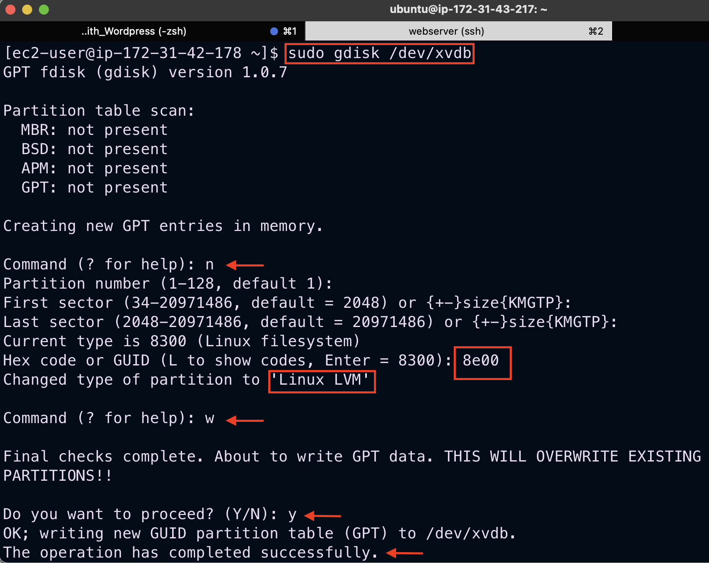

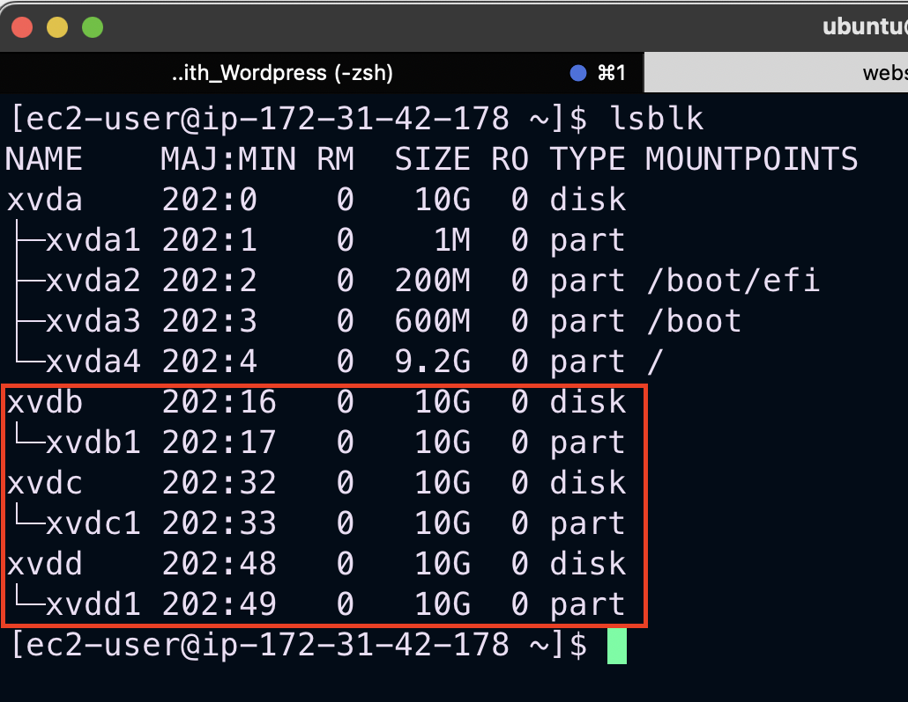


- Installing LVM2 package for creating logical volumes on a linux server.
```
sudo yum install -y lvm2
```
- Check for available partitions
```
sudo lvmdiskscan
```
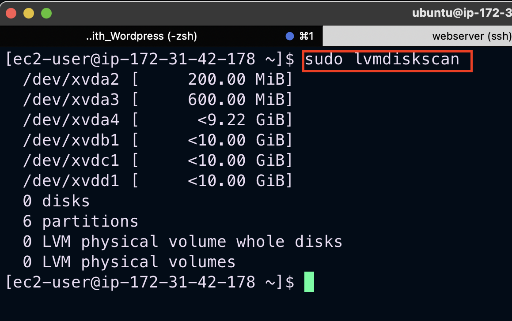


- Creating Physical Volumes on the partitioned disk volumes
`sudo pvcreate <partition_path>`
```
sudo pvcreate /dev/xvdb1
sudo pvcreate /dev/xvdc1
sudo pvcreate /dev/xvdd1
```
- Verify that your Physical volume has been created successfully
```
sudo pvs
```
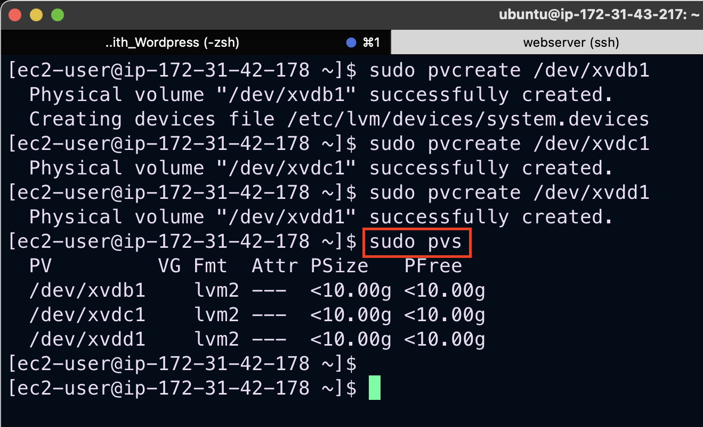

- Next we add up each physical volumes into a volume group named webdata-vg
`sudo vgcreate <grp_name> <pv_path1> ... <pv_path1000> `

```
sudo vgcreate webdata-vg /dev/xvdb1 /dev/xvdc1 /dev/xvdd1
```
- Verify that the VG has been created successfully
```
sudo vgs
```
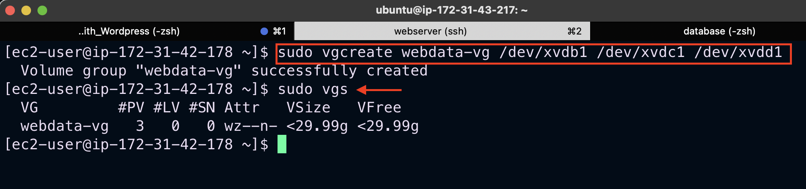

Use `lvcreate` utility to create 2 `logical volumes`.  For `apps-lv` (Use half of the PV size), and for `logs-lv` use the remaining space of the PV size.

*NOTE*: `apps-lv` will be used to store data for the Website while, `logs-lv` will be used to store data for logs.

- Creating Logical volumes for the volume group
`sudo lvcreate -n <lv_name> -L <lv_size> <vg_name>`
```
sudo lvcreate -n apps-lv -L 14G webdata-vg
sudo lvcreate -n logs-lv -L 14G webdata-vg
```
- Verify that the Logical Volume has been created successfully
```
sudo lvs
```
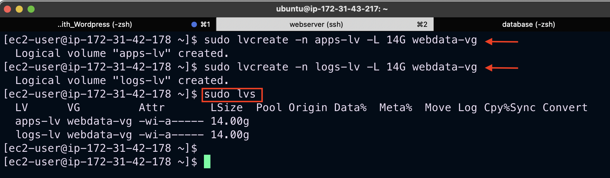

- Verify the entire setup
```
sudo vgdisplay -v #view complete setup - VG, PV, and LV
sudo lsblk
```
Our logical volumes are ready to be used as `filesystems` for storing application and log data.
- Create filesystems on both logical volumes

Use `mkfs.ext4` to format the logical volumes with ext4 filesystem
```
sudo mkfs -t ext4 /dev/webdata-vg/apps-lv
sudo mkfs -t ext4 /dev/webdata-vg/logs-lv
```

The apache webserver uses the `html` folder in the `var` directory to store web content. We create this directory and also a directory for collecting log data of our application.

- Create `/var/www/html` directory to store website files
```
sudo mkdir -p /var/www/html
```
- Create `/home/recovery/logs` to store backup of log data
```
sudo mkdir -p /home/recovery/logs
```
- Mount /var/www/html on apps-lv logical volume
```
sudo mount /dev/webdata-vg/apps-lv /var/www/html/
```
- Use `rsync` utility to backup all the files in the log directory /var/log into /home/recovery/logs *(This is required before mounting the file system)*
```
sudo rsync -av /var/log/. /home/recovery/logs/
```
- Mount /var/log on logs-lv logical volume. *(Note that all the existing data on /var/log will be deleted. That is why the step above is very important)*
```
sudo mount /dev/webdata-vg/logs-lv /var/log
```
- Restore log files back into /var/log directory
```
sudo rsync -av /home/recovery/logs/. /var/log
```
Run `df-h` to view the mounts

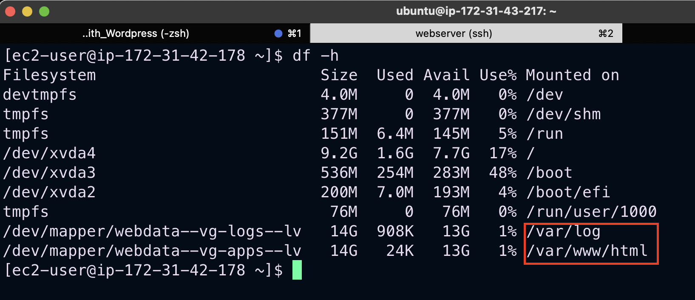

## Persisting Mount Points
- To ensure that all our mounts are not erased on restarting the server, we persist the mount points by configuring the `/etc/fstab` directory

- `sudo blkid` to get UUID of each mount points

- `sudo vi /etc/fstab` to edit the file

- Test the configuration and reload the daemon
```
sudo mount -a
sudo systemctl daemon-reload
```
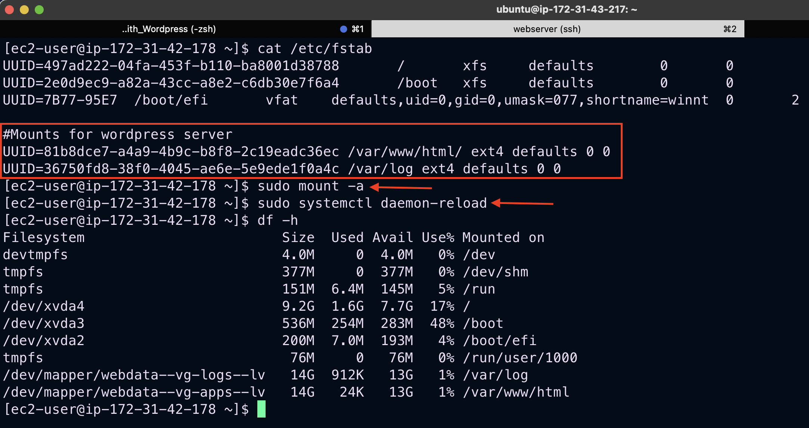

## STEP 2 Preparing Database Server
 - Repeat all the steps taken to configure the `web server` on the db server. Change the `apps-lv` logical volume to `db-lv` and mount it on /db.

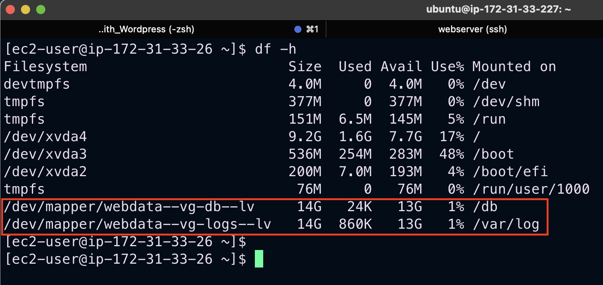

## STEP 3 Install WordPress on Web Server EC2 Instance
Run updates and install `httpd and its dependencies` on web server

- Update the repository
```
sudo yum -y update
```
- Install wget, Apache and it's dependencies
```
sudo yum -y install wget httpd php php-mysqlnd php-fpm php-json
```

- Start Apache
```
sudo systemctl start httpd
sudo systemctl enable httpd
```
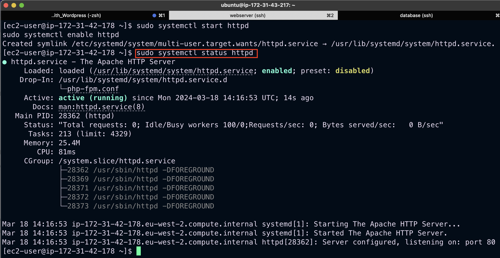

- Installing php and its dependencies
```
sudo yum install https://dl.fedoraproject.org/pub/epel/epel-release-latest-9.noarch.rpm -y
sudo yum install yum-utils http://rpms.remirepo.net/enterprise/remi-release-9.rpm -y
sudo yum module list php
sudo yum module reset php
sudo yum module enable php:remi-7.4 -y
sudo yum install php php-opcache php-gd php-curl php-mysqlnd
sudo systemctl start php-fpm
sudo systemctl enable php-fpm
sudo setsebool -P httpd_execmem 1
```

- Restart Apache: 
```
sudo systemctl restart httpd
```

- Download wordpress and copy wordpress to `/var/www/html` directory
```
mkdir wordpress
cd   wordpress
sudo wget http://wordpress.org/latest.tar.gz
sudo tar xzvf latest.tar.gz
sudo rm -rf latest.tar.gz
sudo cp wordpress/wp-config-sample.php wordpress/wp-config.php
sudo cp -R wordpress /var/www/html/
```

- Configure SELinux Policies
```
sudo chown -R apache:apache /var/www/html/wordpress
sudo chcon -t httpd_sys_rw_content_t /var/www/html/wordpress -R
sudo setsebool -P httpd_can_network_connect=1
```

- Confirm SELinux configuration
```
sudo sestatus
```

## STEP 4 Installing MySQL on DB Server EC2 Instance
- Update the repository
```
sudo yum -y update
```
- Install MySQL Server
```
sudo yum install -y mysql-server
```

To ensure that database server starts automatically on reboot or system startup
```
sudo systemctl restart mysqld
sudo systemctl enable mysqld
```
- Verify that the service is up and running
```
sudo systemctl status mysqld
```

## STEP 5 Configure DB to work with WordPress

```
sudo mysql
CREATE DATABASE wordpress;
CREATE USER `myuser`@`<Web-Server-Private-IP-Address>` IDENTIFIED BY 'mypass';
CREATE USER 'wordpress_user'@'172.31.42.178' IDENTIFIED WITH mysql_native_password BY 'password';
GRANT ALL ON wordpress.* TO 'wordpress_user'@'172.31.42.178';
FLUSH PRIVILEGES;
SHOW DATABASES;
exit
```
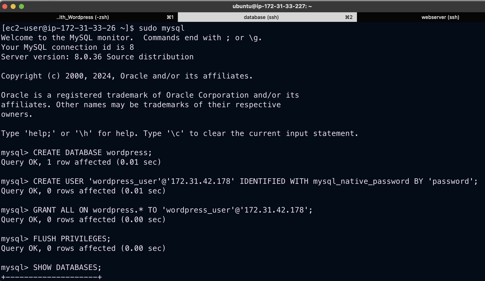

Ensure that we add port `3306` on our db server security group `inbound rules` to allow our web server to access the database server.

## Step 6 Configure WordPress to connect to remote database.

Install MySQl client on the web server so we can connect to the db server

```
sudo yum install -y mysql 
sudo mysql -u wordpress_user -p -h <DB-Server-Private-IP-address>
sudo mysql -u wordpress_user -p -h 172.31.33.26
```
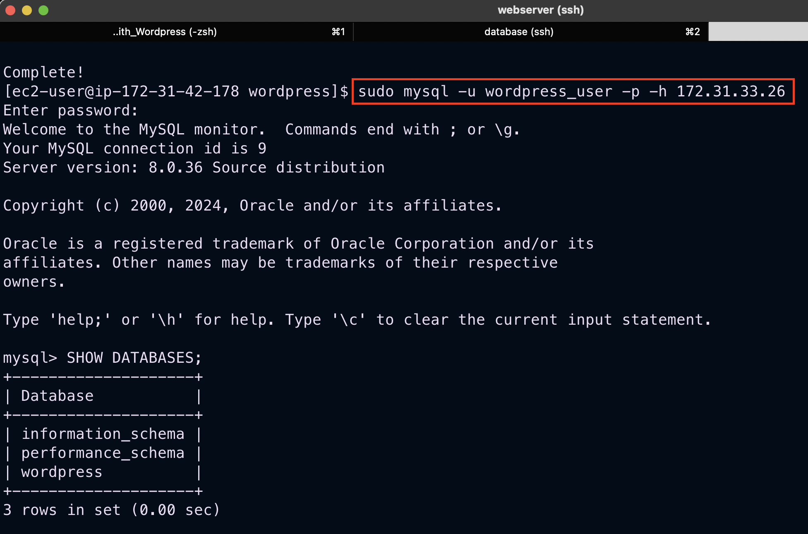

Change permissions and configuration so Apache could use WordPress

- Inside `/var/www/html/wordpress` directory, edit `wp-config.php` file and add in the `wordpress`DB credentials

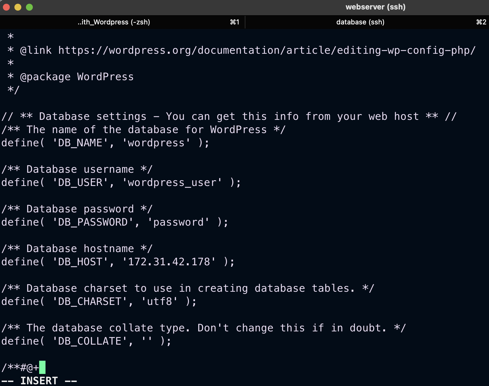


- On the web browser, access web server using the public ip address of the server
`http://<Web-Server-Public-IP-Address>/wordpress/`

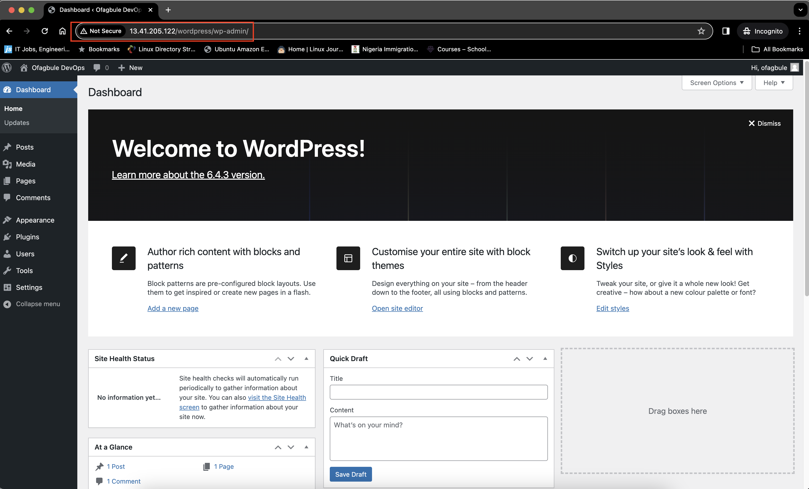


*Challenge*

I had a challenge with installing `php` dependencies, so I used the code below to resolve it
```
sudo yum install php --nobest php-opcache php-gd php-curl php-mysqlnd -y
```