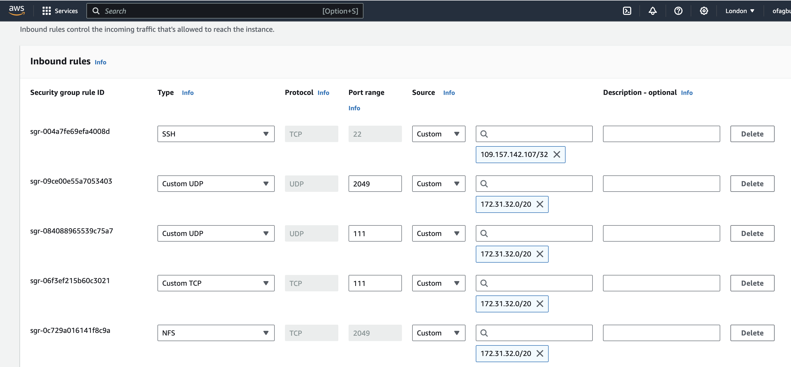
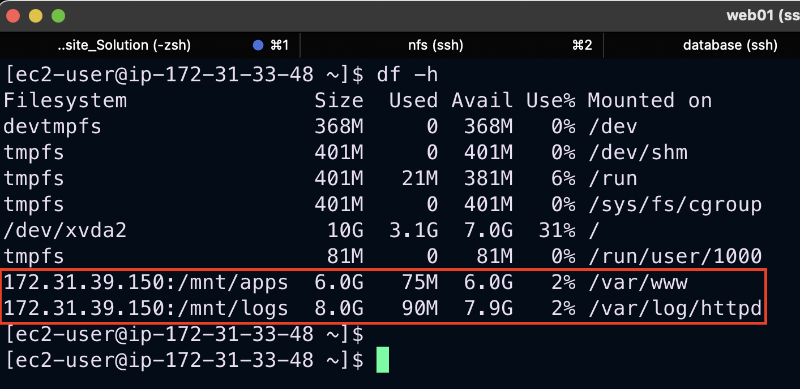
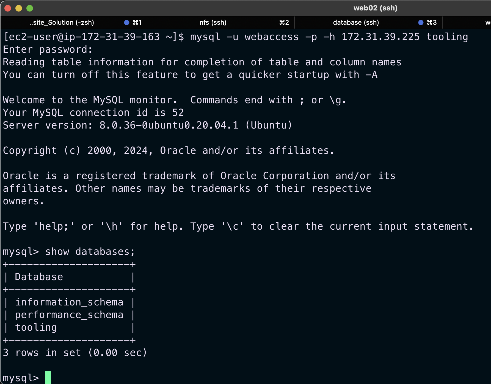

# DevOps-Website-Solution

In this project, as a member of the DevOps team I am implementing a tooling website solution which provide access to essential DevOps tools within the corporate infrastructure. The tools are well known and widely used by multiple DevOps teams. The DevOps Tooling Solution consists of;

1. Jenkins - free and open source automation server used to build CI/CD pipelines.

2. Kubernetes - an open-source container-orchestration system for automating computer application deployment, scaling, and management.

3. Jfrog Artifactory - Universal Repository Manager supporting all major packaging formats, build tools and CI servers. Artifactory.

4. Rancher - an open source software platform that enables organizations to run and manage Docker and Kubernetes in production.

5. Grafana - a multi-platform open source analytics and interactive visualization web application.

6. Prometheus - An open-source monitoring system with a dimensional data model, flexible query language, efficient time series database and modern alerting approach.

7. Kibana - Kibana is a free and open user interface that lets you visualize your Elasticsearch data and navigate the Elastic Stack.

## Architectural Design


On the diagram above we can see a common pattern where several *stateless Web Servers* share a common database and also access the same files using *Network File Sytem (NFS)* as a shared file storage. Even though the NFS server might be located on a completely separate hardware – for Web Servers it looks like a local file system from where they can serve the same files.

This project consists of the following servers:
 - Web server(RHEL)
 - Database server(Ubuntu + MySQL)
 - Storage/File server(RHEL + NFS server)

# STEP 1 - Prepare NFS Server

Create an EC2 instance (Red Hat Enterprise Linux 8 on AWS) on which we will setup our NFS(Network File Storage) Server. 

On this server we attach 2 EBS volumes 10GB each as external storage to our instance and create 3 logical volumes on it through which we will attach mounts from our external web servers.

- 3 logical volumes `lv-opt, lv-apps and lv-logs`
- 3 mount directory `/mnt/opt, /mnt/apps and /mnt/logs`
- Webserver content will be stores in /apps, webserver logs in /logs and /opt will be used by Jenkins


Steps taken to create logical volumes are shown in this [project](https://github.com/Micah-Shallom/Implementing-Wordpress-Web-Solution).

Install `nfs-server` on the nfs instance and ensure that it starts on system reboot
``` 
sudo yum -y update
sudo yum install nfs-utils -y
sudo systemctl start nfs-server.service
sudo systemctl enable nfs-server.service
sudo systemctl status nfs-server.service
```


Set the mount point directory to allow read and write permissions to our webserver
```
sudo chown -R nobody: /mnt/apps
sudo chown -R nobody: /mnt/logs
sudo chown -R nobody: /mnt/opt

sudo chmod -R 777 /mnt/apps
sudo chmod -R 777 /mnt/logs
sudo chmod -R 777 /mnt/opt
```

Restart NFS service
```
sudo systemctl restart nfs-server.service
```

*Note*: For simplicity, we will install all three Web Servers and the database-server inside the same subnet. However, in a production set up, we would probably want to separate each tier inside its own subnet for higher level of security.

Configure NFS to interact with clients present in the same subnet.

*We can find the subnet ID and CIDR in the Networking tab of our instances*

```
sudo vi /etc/exports
```
Add in the below
```
/mnt/apps <Subnet-CIDR>(rw,sync,no_all_squash,no_root_squash)
/mnt/logs <Subnet-CIDR>(rw,sync,no_all_squash,no_root_squash)
/mnt/opt <Subnet-CIDR>(rw,sync,no_all_squash,no_root_squash)
```
Use the `exportfs` utility to selectively export directories without restarting NFS service
```
sudo exportfs -arv
```


To check what port is used by NFS so we can open it in security group
```
rpcinfo -p | grep nfs
```


The following ports are to be open on the NFS server



# STEP 2 - Configure Database Server

Create an Ubuntu Server on AWS which will serve as our Database server. Ensure it is in the same subnet as the NFS-Server.

Install mysql-server 

```
sudo apt -y update
sudo apt install -y mysql-server
```
To enter the db environment run
```
sudo mysql
```
- Create a `database` and name it `tooling`
- Create a `database user` and name it `webaccess`
- Grant permission to `webaccess` user on `tooling` database to do anything only from the webservers `subnet cidr`
```
CREATE DATABASE tooling;
CREATE USER 'webaccess'@'172.31.32.0/20' IDENTIFIED WITH mysql_native_password BY 'password';
GRANT ALL ON tooling.* TO 'webaccess'@'172.31.32.0/20';
FLUSH PRIVILEGES;
SHOW DATABASES;
```
Edit `bind address` to (bind-address = 0.0.0.0 ) be able to connect MySQL from any server
```
sudo vi /etc/mysql/mysql.conf.d/mysqld.cnf
```
Restart MySQL
```
sudo systemctl restart mysql
```

# STEP 2 - Prepare Web Servers

We need to make sure that our Web Servers can serve the same content from shared storage solutions, in our case - NFS Server and MySQL database.

We already know that one DB can be accessed for `reads` and `writes` by multiple clients. For storing shared files that our Web Servers will use - we will utilize NFS and mount previously created Logical Volume `lv-apps` to the folder where Apache stores files to be served to the users (`/var/www`).

This approach will make our Web Servers `stateless`, which means we will be able to add new ones or remove them whenever we need to, and the integrity of the data (in the database and on NFS) will be preserved.

Create a 3 RHEL EC2 instances on AWS which to serve as our web servers. Also remember to have in it in same subnet as NFS-server

A couple of configurations will be done on the web servers:

- Configure NFS client (this step must be done on all three servers)
- Deploy a Tooling application to our Web Servers into a shared NFS folder
- Configure the Web Servers to work with a single MySQL database

Installing NFS-Client
```
sudo yum update -y
sudo yum install nfs-utils nfs4-acl-tools -y
```

We will be connecting our `/var/www` directory to our webserver with the `/mnt/apps` on nfs server. This is acheived by mounting the NFS server directory to the webserver directory
```
sudo mkdir -p /var/www
sudo mount -t nfs -o rw,nosuid <NFS-Server-Private-IP-Address>:/mnt/apps /var/www
```
Verify that NFS was mounted successfully by running `df -h`


We then need to ensure that our mounts persists when the server reboots. This is achieved by configuring the fstab directory. 
```
sudo vi /etc/fstab
```

Add the following line 
```
<NFS-Server-Private-IP-Address>:/mnt/apps /var/www nfs defaults 0 0
```


### Installing Apache and Php

```
sudo yum install httpd -y

sudo dnf install -y https://dl.fedoraproject.org/pub/epel/epel-release-latest-8.noarch.rpm

sudo dnf install -y dnf-utils http://rpms.remirepo.net/enterprise/remi-release-8.rpm

sudo dnf module reset php

sudo dnf module -y enable php:remi-7.4

sudo dnf install -y php php-opcache php-gd php-curl php-mysqlnd

sudo systemctl start php-fpm

sudo systemctl enable php-fpm

sudo setsebool -P httpd_execmem 1
```

We can see that both `/var/www and /mnt/apps` contains same content. This shows that both mount points are connected via NFS.


We locate the log folder for Apache on the Web Server and mount it to NFS server’s export for logs. Make sure the mount point will persist after reboot.

- Stop Apache service
```
sudo systemctl stop httpd
```
- Create a back-up of Apache logs
```
sudo mv /var/log/httpd /var/log/httpd.bak
```
- Create new Apache log directory
```
sudo mkdir -p /var/log/httpd
```
- Mount the new Apache log directory to target logs directory of NFS server
```
sudo mount -t nfs -o rw,nosuid 172.31.39.150:/mnt/logs /var/log/httpd
```
- Add entry into fstab to ensure it persists at system boot up
```
sudo vi /etc/fstab
```

- Add the following line 
```
172.31.39.150:/mnt/logs /var/log/httpd nfs defaults 0 0
```
- Test for any errors
```
sudo mount -a
```
- Reload the daemon
```
sudo systemctl daemon-reload
```


- Copy the files from httpd.bak into the bew Apache directory
```
sudo rsync -avh /var/log/httpd.bak/. /var/log/httpd
```

```
sudo setenforce 0
```
- Disable Selinux (SELINUX=disabled)
```
sudo vi /etc/sysconfig/selinux
```
- Restart Apache
```
sudo systemctl restart httpd
```





- View Apache log
```
sudo tail -f /var/log/httpd/access_log
```


On the NFS Server, add web content into the `/mnt/apps` directory. This should contain a `html` folder. The same content will be present in the `/var/www` directory in the web servers.

- Clone the `tooling` source code and copy it to `/mnt/apps` directory
```
sudo yum install -y git
git clone https://github.com/slimboi/tooling.git
sudo cp -R tooling/. /mnt/apps/
```


Run `<webserver_public_ip_address>` on a web browser to access the site. TCP port 80 should be open on the web broswer.


In the `/var/www/html` directory , edit the already written php script to connect to the database 
```
sudo vi /var/www/html/functions.php
```


After the modification , connect to the database server from the web server 

Install `mysql client` on the webserver
```
sudo yum install mysql -y
```
Apply `tooling-db.sql` script to the database
```
mysql -h <databse-private-ip> -u <db-username> -p tooling < tooling-db.sql
```



Simulate a sign up process by adding user credentials manually to the database
```
INSERT INTO users(id, username, password, email, user_type, status) VALUES(3, 'ofagbule', '5f4dcc3b5aa765d61d8327deb882cf99', 'user@mail.com', 'DevOps-Lead', '1');
```


Login by running the following on the browser `<webserver_public_ip_address>`.

- Make sure you can log into the website with `ofagbule` user.


