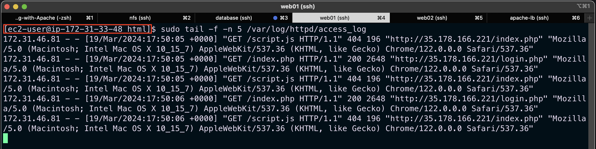

## Load Balancer Solution With Apache #

#### WHY LOAD BALANCER ?

When we access a website over the Internet we use a `URL` and we do not really know how many servers are out there serving our requests. This complexity is hidden from a regular user, but in a case of websites that are being visited by millions of users per day (like Google or Reddit) it is impossible to serve all the users from a single Web Server (it is also applicable to databases, but for now we will not focus on distributed DBs).

Each URL contains a domain name part, which is translated (resolved) to the IP address of a target server that will serve requests when we open a website on the Internet. Translation (resolution) of domain names is perormed by DNS servers.

When you have just one Web server and load increases - you want to serve more and more customers, you can add more CPU and RAM or completely replace the server with a more powerful one - this is called `vertical scaling`. This approach has limitations - at some point you reach the maximum capacity of CPU and RAM that can be installed into your server.

Another approach used to cater for increased traffic is `horizontal scaling` - distributing load across multiple Web servers. This approach is much more common and can be applied almost seamlessly and almost infinitely.

`Scalability` - is the property of a system (in our case it is the Web tier) to be able to handle growing load by adding resources.

In the set-up for `Project-7` we had 3 Web Servers and each of them had its own public IP address and public DNS name. A client has to access them by using different URLs, which is not a nice user experience to remember addresses/names of even 3 server, let alone millions of Google servers.

In order to hide all this complexity and to have a single point of access with a single public IP address/name, a `Load Balancer` can be used. A Load Balancer (LB) distributes clients' requests among underlying Web Servers and makes sure that the load is distributed in an optimal way.

- In this project I will enhance the Tooling Website solution by adding a `Load Balancer` to distribute traffic between Web Servers and allow users to access our website using a single URL.

I am going to deploy and configure an `Apache Load Balancer` for Tooling Website solution on a separate Ubuntu EC2 intance.

- Prerequisites

Make sure that the following servers are installed and configured from Project-7:

1. Two RHEL8 Web Servers
2. One MySQL DB Server (based on Ubuntu 20.04)
3. One RHEL8 NFS server


### Configure Apache As A Load Balancer
1. Create an Ubuntu Server 20.04 EC2 instance and name it Project-8-apache-lb.

2. Open TCP port 80 on Project-8-apache-lb by creating an Inbound Rule in the Security Group attached to the instance.

3. Install Apache Load Balancer on Project-8-apache-lb server and configure it to point traffic coming to LB to both Web Servers.

- Install apache2
```
sudo apt update
sudo apt install apache2 -y
sudo apt-get install libxml2-dev -y
```
- Enable following modules:
```
sudo a2enmod rewrite
sudo a2enmod proxy
sudo a2enmod proxy_balancer
sudo a2enmod proxy_http
sudo a2enmod headers
sudo a2enmod lbmethod_bytraffic
```
- Restart apache2 service
```
sudo systemctl restart apache2
```
- Make sure apache2 is up and running
```
sudo systemctl status apache2
```


## Configuring Load Balancer

Edit the `default.conf` file to add the backend web servers into the loadbalancers proxy for routing.
```
sudo vi /etc/apache2/sites-available/000-default.conf

```
```
#Add this configuration into this section <VirtualHost *:80>  </VirtualHost>

<Proxy "balancer://mycluster">
               BalancerMember http://172.31.33.48:80 loadfactor=5 timeout=1
               BalancerMember http://172.31.39.163:80 loadfactor=5 timeout=1
               ProxySet lbmethod=bytraffic
               # ProxySet lbmethod=byrequests
        </Proxy>

        ProxyPreserveHost On
        ProxyPass / balancer://mycluster/
        ProxyPassReverse / balancer://mycluster/

```
*Note:* Only 2 servers were added to the proxy list. There are also other ways to route traffic asides `bytraffic` which includes `byrequests, bybusyness, heartbeats`. It can be specified in `ProxySet lbmethod=?` .


- Restart the apache2 server 
```
sudo systemctl restart apache2
```

On the web browser, test the load balancing connection using the public Ip address of our load balancer server.
```
http://<Load-Balancer-Public-IP-Address-or-Public-DNS-Name>/index.php
```


To confirm that traffic is routed evenly to both web servers as the load balancer server is receiving traffic (which in our case is by refreshing the webpage) we can check the logs both servers receive 

- Open two terminal consoles for both Web Servers and run following command:
```
sudo tail -f -n 5 /var/log/httpd/access_log
```
- Try to refresh the browser page http://<Load-Balancer-Public-IP-Address-or-Public-DNS-Name>/index.php several times and make sure that both servers receive HTTP GET requests from the LB – new records must appear in each server’s log file. The number of requests to each server will be approximately the same since we set `loadfactor` to the same value for both servers – it means that traffic will be distributed evenly between them.

Server1

Server2


## Configure Local DNS Names Resolution

Sometimes it is tedious to remember and switch between IP addresses, especially if you have a lot of servers under your management.
What we can do, is to configure local domain name resolution. The easiest way is to use `/etc/hosts` file, although this approach is not very scalable, but it is very easy to configure and shows the concept well. 

So let us configure IP address to domain name mapping for our LB.

- Open the hosts file on the load balancer server
```
sudo vi /etc/hosts
```


To see this is play we can `curl` our dns name on the loadbalancer server. Since the DNS names are local DNS configuration we can only access them locally hence the loadbalancer uses them locally to target the backend web servers

`curl http://web1` or `curl http://web2`

Server1_Web1


Server2_Web2


Now our set-up looks like this

