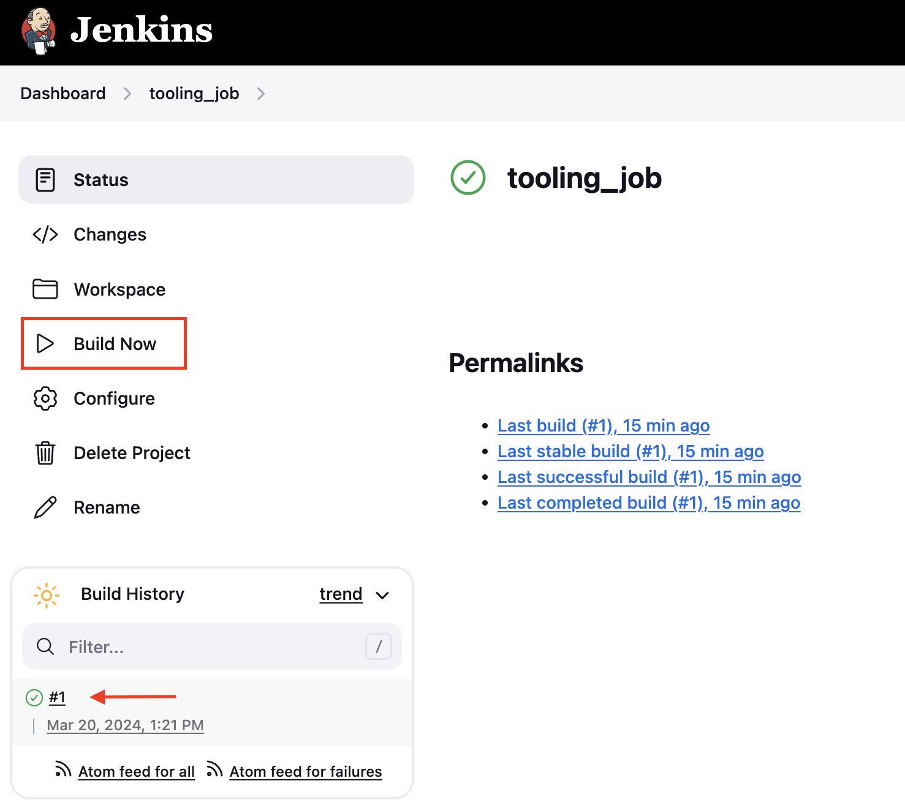

## Tooling Website deployment automation with Continuous Integration

## Introduction
Jenkins is an open-source `Continuous Integration` server written in Java for orchestrating a chain of actions to achieve the Continuous Integration process in an automated fashion. Jenkins supports the complete development life cycle of software from building, testing, documenting the software, deploying, and other stages of the software development life cycle.


Here I have enhanced the architecture prepared in Project 8 by adding a Jenkins server, and also configured a job to automatically deploy source code changes from Git to NFS server.

## Jenkins Web Architecture For CI Builds
 


## Installing Jenkins Server
Spin up an Ubuntu 20.04 server on AWS cloud and SSH into it. Name it `Jenkins`.

Install JDK which is an important Java based package required for Jenkins to run.
```
sudo apt update
sudo apt install default-jdk-headless -y
```
Install Jenkins
```
sudo wget -O /usr/share/keyrings/jenkins-keyring.asc \
  https://pkg.jenkins.io/debian-stable/jenkins.io-2023.key
echo deb [signed-by=/usr/share/keyrings/jenkins-keyring.asc] \
  https://pkg.jenkins.io/debian-stable binary/ | sudo tee \
  /etc/apt/sources.list.d/jenkins.list > /dev/null
sudo apt-get update
sudo apt-get install jenkins -y

sudo systemctl enable jenkins
sudo systemctl start jenkins
sudo systemctl status jenkins
```


Since Jenkins runs on default port 8080, open this port on the Security Group inbound rule of the jenkins server on AWS 

Jenkins is up and running, copy and paste jenkins server public ip address appended with port 8080 on a web server to gain access to the interactive console. `<jenkins_server_public_ip_address>:8080`


The admin password can be found in the `'/var/lib/jenkins/secrets/initialAdminPassword'` path on the server.

Choose suggested plugins when asked which plugings to install 

Once plugins installation is done – create an `admin user` and we will get the Jenkins server address.


## Attaching WebHook to Jenkins Server

On the github repository that contains application code, create a webhook to connect to the jenkins job. To create webhook, go to the settings tab on the github repo and click on webhooks.
Webhook should look like this `<public_ip_of_jenkins_server>:8080/github-webhook/`


## Creating Job and Configuring GIT Based Push Trigger

Jenkins web console, click `New Item` and create a `Freestyle project`

In configuration of the Jenkins freestyle job choose Git repository, provide there the link to the `tooling` GitHub repository and credentials (user/password) so Jenkins could access files in the repository. Also specify the branch containing code


Save configuration and to run the build manually. Click `Build Now` button and should be under #1



You can open the build and check in `Console Output` if it has run successfully.


## Configuring Build Triggers

This build does not produce anything and it runs only when we trigger it manually. To fix this:

- Click `Configure` your job/project and add these two configurations

### 1. Configure triggering the job from GitHub webhook:


### 2. Configure `Post-build Actions` to archive all the files – files resulted from a build are called `artifacts`.


Now, we can go ahead and make some change in any file in our `tooling` GitHub repository (e.g. Readme.Md file) and push the changes to the `master` branch.

A new build has been launched automatically (by webhook) and you can see its results – artifacts, saved on Jenkins server


An automated Jenkins job that receives files from GitHub by webhook trigger has been configured(this method is considered as `push` because the changes are being `pushed` and files transfer is initiated by GitHub)

By default, the artifacts are stored on Jenkins server locally
```
ls /var/lib/jenkins/jobs/tooling_github/builds/<build_number>/archive/
```


## Configuring Jenkins To Copy Files(Artifact) to NFS Server

To achieve this, we install the `Publish Via SSH` pluging on Jenkins.
The plugin allows one to send newly created packages to a remote server and install them, start and stop services that the build may depend on and many other use cases.

On main dashboard select "Manage Jenkins" and choose "Manage Plugins" menu item.

On "Available" tab search for "Publish Over SSH" plugin and install it


Configure the job to copy artifacts over to NFS server.
On main dashboard select `Manage Jenkins` and choose "Configure System" menu item.

Scroll down to `Publish over SSH` plugin configuration section and configure it to be able to connect to the NFS server:

Provide a private key (content of .pem file that you use to connect to NFS server via SSH/Putty)

Hostname – can be `private IP address` of NFS server
Username – ec2-user (since NFS server is based on EC2 with RHEL 8) 
Remote directory – /mnt/apps since our Web Servers use it as a mointing point to retrieve files from the NFS server

Test the configuration and make sure the connection returns Success. Remember, that TCP port 22 on NFS server must be open to receive SSH connections.


Save the configuration, open your Jenkins job/project configuration page and add another `Post-build Action`

We specify `**` on the `send build artifacts` tab meaning it sends all artifact to specified destination path(NFS Server). 


Now make a new change on the source code and push to github, Jenkins builds an artifact by downloading the code into its workspace based on the latest commit and via SSH it publishes the artifact into the NFS Server to update the source code. 

This is seen by the change of name on the web application


