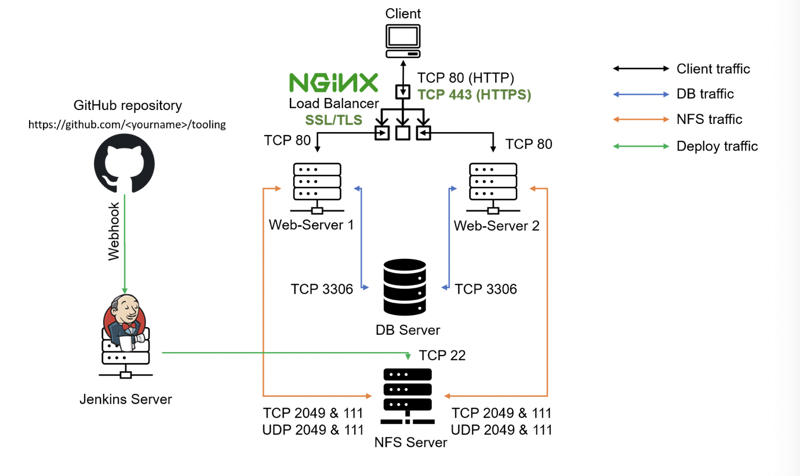

## LOAD BALANCER SOLUTION WITH NGINX AND SSL/TLS

It is extremely important to ensure that connections to any Web solutions are secure and information is encrypted in transit.

When data is moving between a client (browser) and a Web Server over the Internet – it passes through multiple network devices and, if the data is not encrypted, it can be relatively easy to intercept it by someone who has access to the intermediate equipment. This kind of information security threat is called `Man-In-The-Middle (MIMT) attack`.

This threat is real – users that share sensitive information (bank details, social media access credentials, etc.) via non-secured channels, risk their data to be compromised and used by cybercriminals.

`SSL/TSL` – is a security technology that protects connection from MITM attacks by creating an encrypted session between browser and Web server. 

SSL/TLS uses digital certificates to identify and validate a Website. A browser reads the certificate issued by a Certificate Authority (CA) to make sure that the website is registered in the CA so it can be trusted to establish a secured connection.

In this project we will register our website with `LetsEnrcypt` Certificate Authority, to automate certificate issuance we will use a shell client recommended by `LetsEncrypt cetrbot`.

This project consists of two parts:

1. Configure Nginx as a Load Balancer
2. Register a new domain name and configure secured connection using SSL/TLS certificates.

The target architecture will look like this:

