## LOAD BALANCER SOLUTION WITH NGINX AND SSL/TLS

It is extremely important to ensure that connections to any Web solutions are secure and information is encrypted in transit.

When data is moving between a client (browser) and a Web Server over the Internet – it passes through multiple network devices and, if the data is not encrypted, it can be relatively easy to intercept it by someone who has access to the intermediate equipment. This kind of information security threat is called `Man-In-The-Middle (MIMT) attack`.

This threat is real – users that share sensitive information (bank details, social media access credentials, etc.) via non-secured channels, risk their data to be compromised and used by cybercriminals.

`SSL/TSL` – is a security technology that protects connection from MITM attacks by creating an encrypted session between browser and Web server. 

SSL/TLS uses digital certificates to identify and validate a Website. A browser reads the certificate issued by a Certificate Authority (CA) to make sure that the website is registered in the CA so it can be trusted to establish a secured connection.

In this project we will register our website with `LetsEnrcypt` Certificate Authority, to automate certificate issuance we will use a shell client recommended by `LetsEncrypt cetrbot`.

This project consists of two parts:

1. Configure Nginx as a Load Balancer
2. Register a new domain name and configure secured connection using SSL/TLS certificates.

The target architecture will look like this:


## Configure Nginx As A Load Balancer
1. Create an EC2 VM based on Ubuntu Server 20.04 LTS and name it `Nginx LB`. 

NB; open TCP port 80 for HTTP connections, also open TCP port 443 – this port is used for secured HTTPS connections.

2. Update `/etc/hosts` file for local DNS with Web Servers names (e.g. Web1 and Web2) and their local IP addresses just like it was done with the apache load balancer.

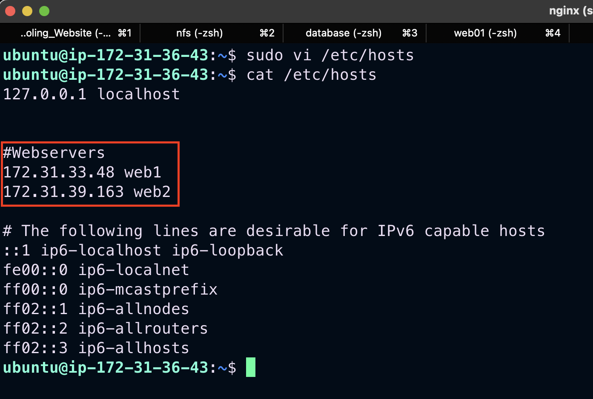

3. Install and configure Nginx as a load balancer to point traffic to the resolvable DNS names of the webservers
```
sudo apt update
sudo apt install -y nginx
sudo systemctl enable nginx
```
- Configure Nginx LB using `Web Servers` names defined in /etc/hosts

```
sudo vi /etc/nginx/nginx.conf
```

- Insert following configuration into `http` section
```
 upstream myproject {
    server web1 weight=5;
    server web2 weight=5;
  }

server {
    listen 80;
    server_name www.domain.com;
    location / {
      proxy_pass http://myproject;
    }
  }
```
- Comment out this line

*include /etc/nginx/sites-enabled/*;

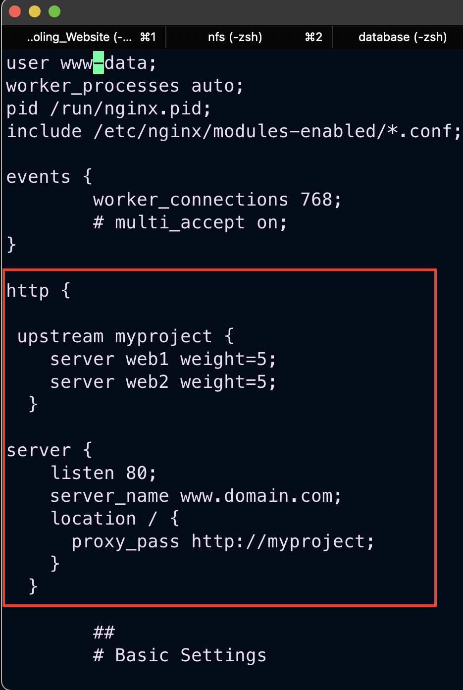

4. Restart Nginx and verify server status.
```
sudo systemctl restart nginx
sudo systemctl status nginx
```
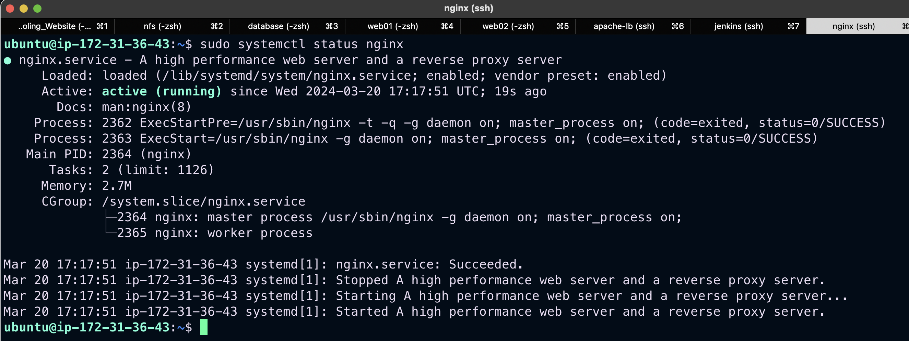

## REGISTER A NEW DOMAIN NAME AND CONFIGURE SECURED CONNECTION USING SSL/TLS CERTIFICATES

To get a valid SSL certificate, there is the need to register a new domain name, this can be done using any Domain name registrar; a company that manages reservation of domain names

1. Register a new domain name with any registrar 

2. Assign an Elastic IP to Nginx LB server and associate the domain name with the Elastic IP.

- You might have noticed, that every time you restart or stop/start your EC2 instance - you get a new public IP address. When you want to associate your domain name - it is better to have a static IP address that does not change after reboot. Elastic IP is the solution for this problem

3. Update A record in your registrar to point to Nginx LB using Elastic IP address

- Go to your AWS account, search and click `Route 53` , go to hosted zones, and create a hosted zone. After the successful creation of hosted zone, create `A` record, add the domain name and the Nginx server static IP address as the value/route traffic section.

- Then go to the Domain Name Registrar and search for Manage DNS. Enter the `name servers` from Route53.

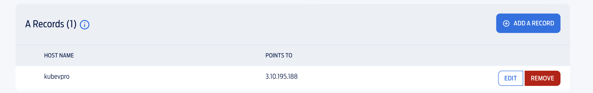

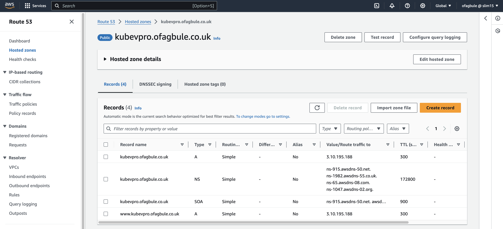

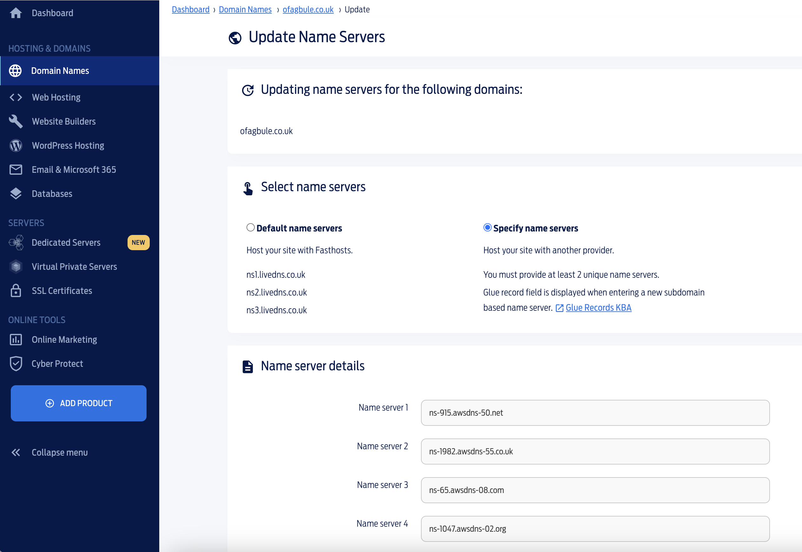

4. Configure Nginx to recognize the new domain name. This was done by Updating the /etc/nginx/nginx.conf file with 
```
server_name www.<your-domain-name.com>
```
 instead of *server_name www.domain.com*

 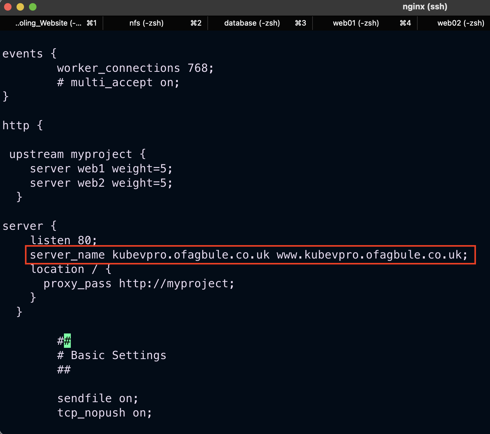

- Visit website by entering `domain name`

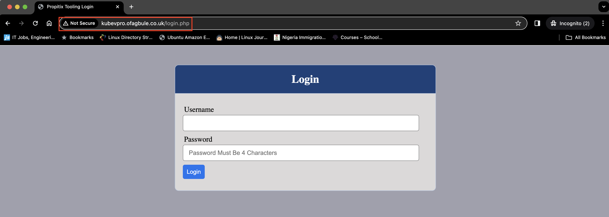


5. Install certbot and request for an SSL/TLS certificate for the domain name.
**N.B: Make sure snapd is running on the server.**
```
sudo systemctl status snapd
```
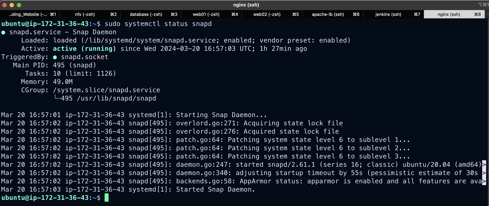

```
sudo snap install --classic certbot
```
6. Make a Request your certificate for the domain name.
```
sudo ln -s /snap/bin/certbot /usr/bin/certbot
sudo certbot --nginx
```
Follow the instruction displayed.

- Test secured access to your Web Solution by trying to reach `https://<your-domain-name.com>`

- You shall be able to access your website by using HTTPS protocol (that uses TCP port 443) and see a padlock pictogram in your browser’s search string. Click on the padlock icon and you can see the details of the certificate issued for your website

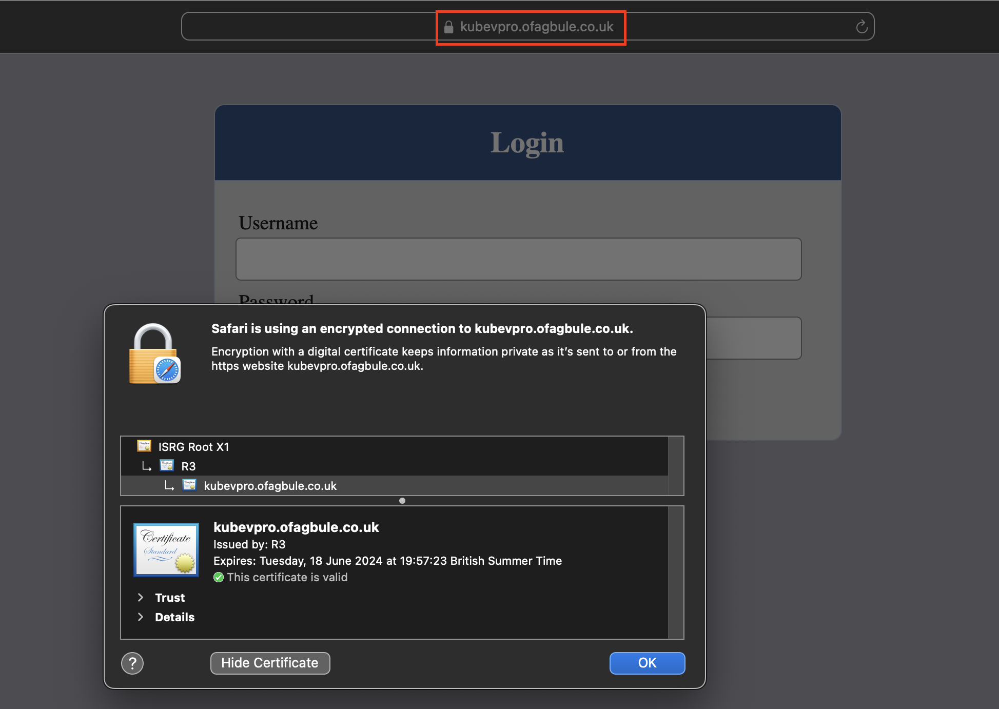


7. Lets Encrypt renews every 90 days and you can renew your certificate manually by running the following command.
```
sudo certbot renew --dry-run
```
We can also create a cron job to do this same thing at a stipulated time. 

- Edit cron file
```
crontab -e
```
- Add the following line to the crontab file
```
5 */12 * */2 *   root /usr/bin/certbot renew > /dev/null 2>&1
```
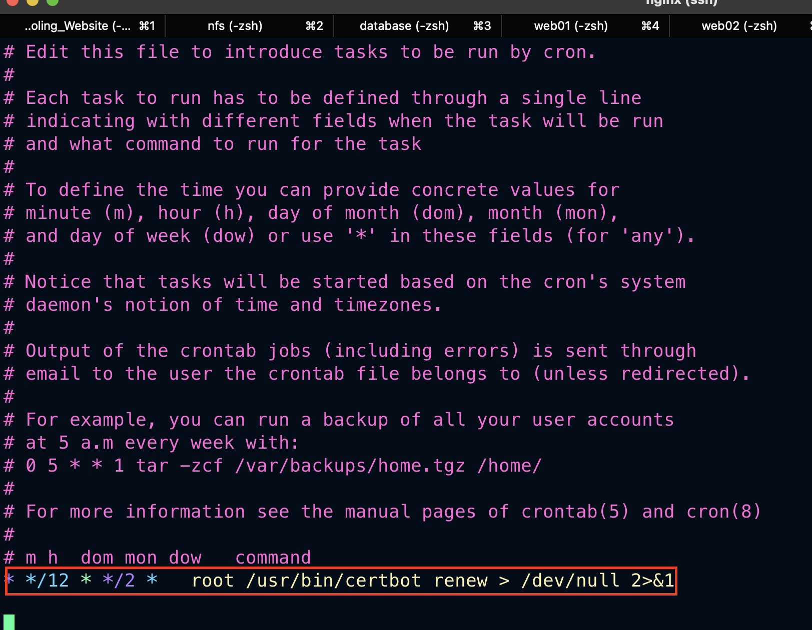

- Save the crontab file

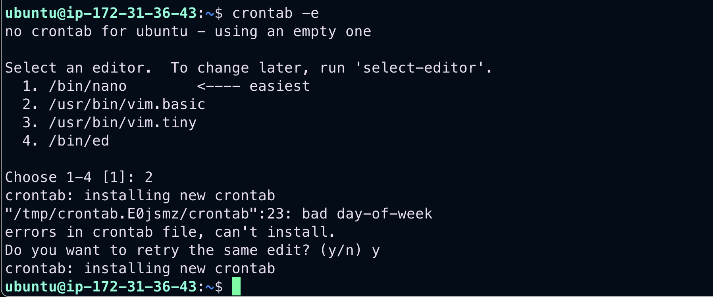

## Challenge Faced
While requesting a certificate from letsencrypt for my domain, I ran into the error below

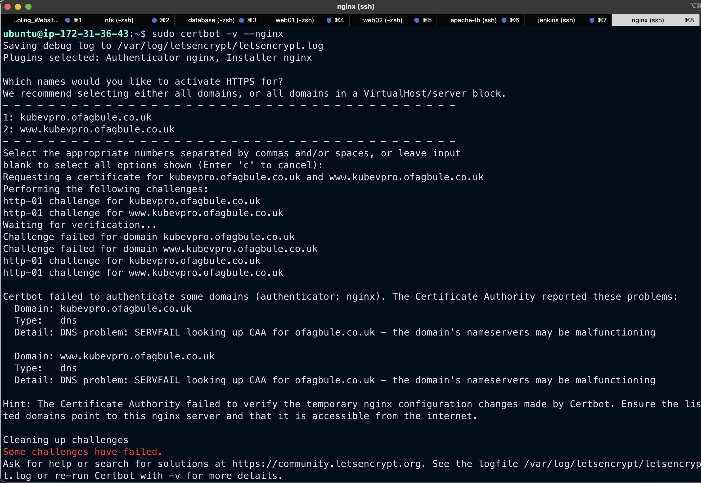

After some research, I found out I needed to create a CAA record to enable the validation to be done. Once I did this, the domain validation was done, and the certificate was issued. I used an aricle from fasthosts my domain registrar https://help.fasthosts.co.uk/app/answers/detail/a_id/3199/~/setting-up-dns-caa-records

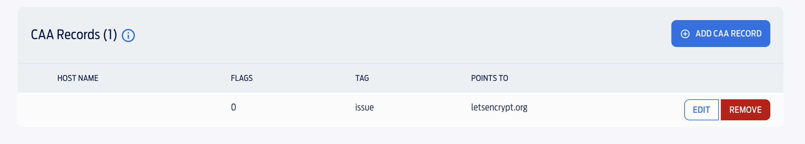