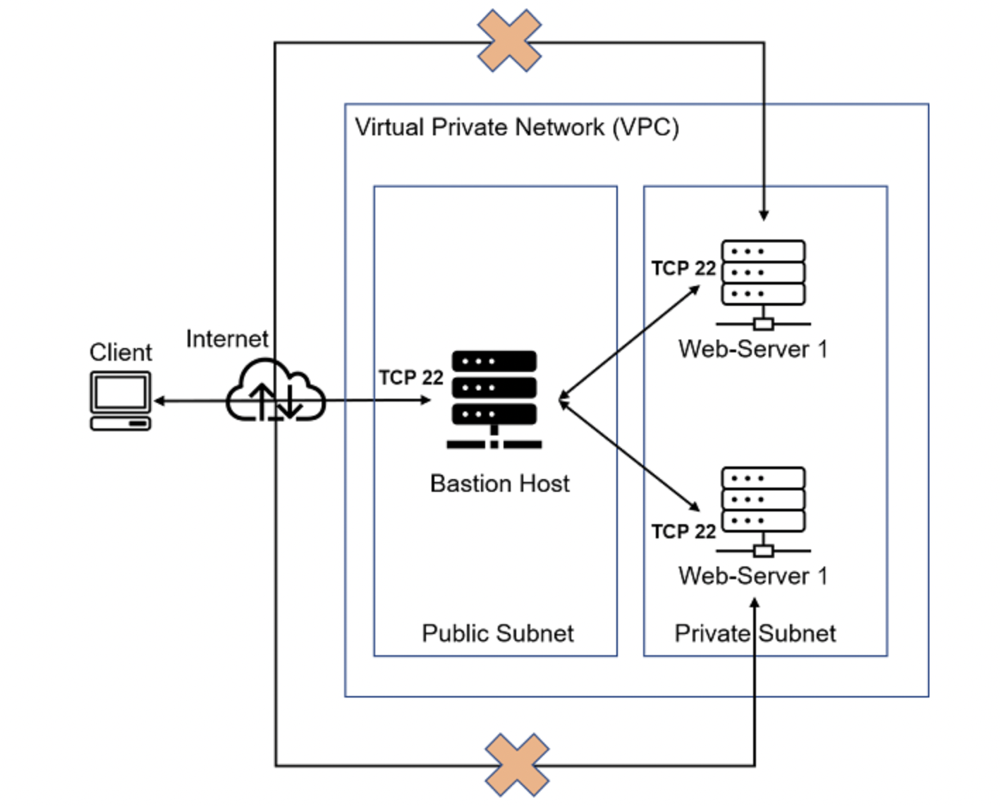
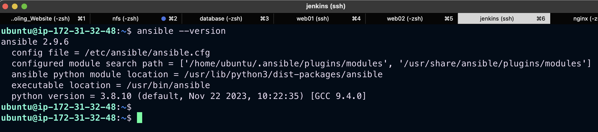
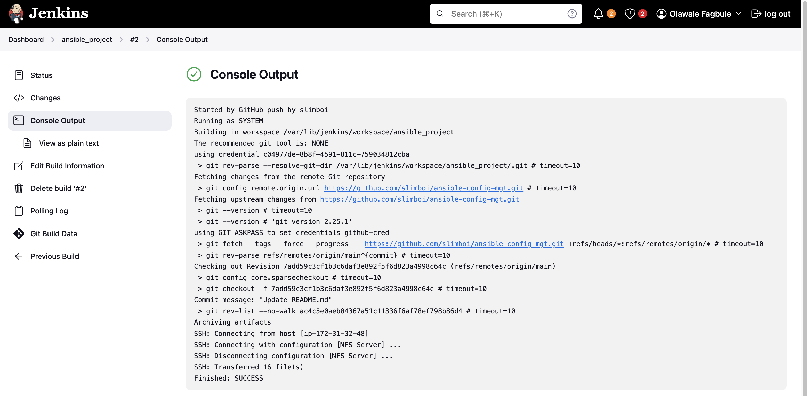
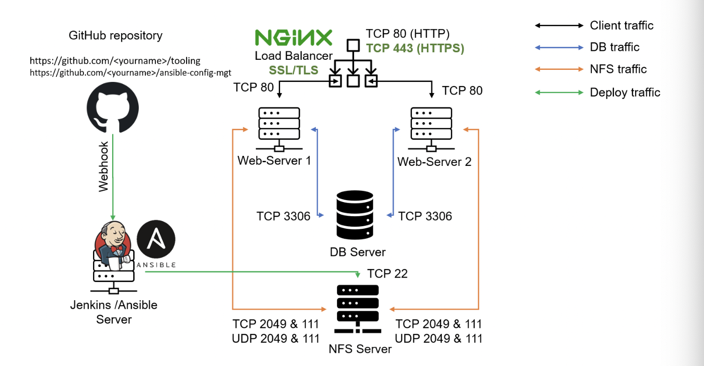
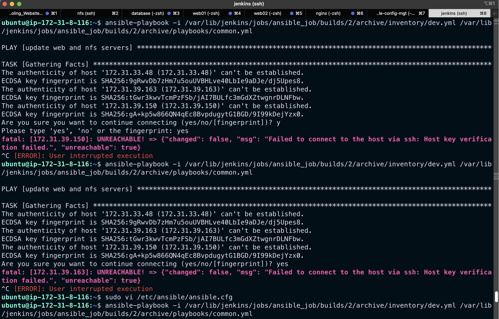
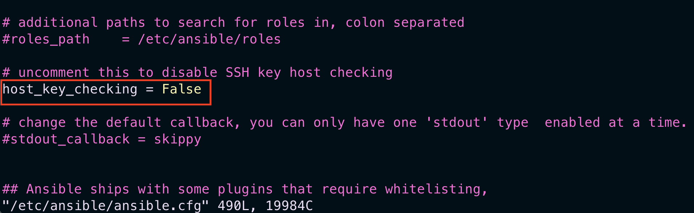

## Automate_Project_7_TO_10

### Ansible Client as a Jump Server (Bastion Host)

A Jump Server (sometimes also referred as Bastion Host) is an intermediary server through which access to internal network can be provided. For instance, the current architecture I am working on, ideally, the webservers would be inside a secured network which cannot be reached directly from the Internet. That means, even DevOps engineers cannot `SSH` into the Web servers directly and can only access it through a Jump Server – it provide better security and reduces attack surface.

On the diagram below the Virtual Private Network (VPC) is divided into two subnets - Public subnet which has public IP addresses and Private subnet which is only reachable by private IP addresses.



### TASK

1. Install and configure Ansible client to act as a Jump Server/Bastion Host.

2. Create a simple Ansible playbook to automate servers configuration.

### STEP 1: INSTALL AND CONFIGURE ANSIBLE ON EC2 INSTANCE
We will install ansible on our jenkins server and rename it to `Jenkins-Ansible`

```
sudo apt update

sudo apt install ansible -y
```

Check your Ansible version by running `ansible --version`



Create a new repository called `ansible-config-mgt` on github and set up webhooks on it.

`https://<jenkins_url:port/github-webhooks>`

On the Jenkins server, create a job called `ansible` and configure automatic builds when a trigger is made on the `ansible-config-mgt` directory via GITScm polling.

Test configuration by updating a README file on github.



Now the setup looks like this;



*Note*; Every time you stop/start your Jenkins-Ansible server – you have to reconfigure GitHub webhook to a new IP address, in order to avoid it, it makes sense to allocate an Elastic IP to your Jenkins-Ansible server.(Refer to LB server in Project 10).

## STEP 2 – Prepare your development environment using Visual Studio Code

Download and install vscode which will be used to write and edit code.

## Ansible Configuration

Clone `ansible-config-mgt` repo on local machine and create a new branch for development 
```
git checkout -b feature/prj-11
```

- Create a directory and named `playbooks` – it will be used to store all your playbook files.
- Create a directory and name it `inventory` – it will be used to keep your hosts organised.
- In the `playbooks folder`, create a `common.yml` file
- In the `inventory folder`, create `dev.yml, prod.yml, staging.yml and uat.yml` for dev, prod, staging and uat environments respectively.


## Step 3 – Set up an Ansible Inventory

An Ansible `inventory` file defines the hosts and groups of hosts upon which commands, modules, and tasks in a playbook operate. Since our intention is to execute Linux commands on remote hosts, and ensure that it is the intended configuration on a particular server that occurs. It is important to have a way to organize our hosts.

Save the below inventory structure in the `inventory/dev file` to start configuring your development servers. Ensure to replace the IP addresses according to your own setup.

Note: Ansible uses TCP port 22 by default, which means it needs to ssh into target servers from Jenkins-Ansible host – for this you can implement the concept of `ssh-agent`. Now you need to import your key into ssh-agent:

using SSH-Agent to upload our ssh public key to the jenkins-ansible server

```
eval `ssh-agent -s`
ssh-add <path-to-private-key>
```
Confirm the key has been added with the command below, you should see the name of your key
```
ssh-add -l
```
Now, ssh into your Jenkins-Ansible server using ssh-agent
```
ssh -A ubuntu@public-ip
```

updating our /inventory/dev.yaml
```
[nfs]
<NFS-Server-Private-IP-Address> ansible_ssh_user='ec2-user'

[webservers]
<Web-Server1-Private-IP-Address> ansible_ssh_user='ec2-user'
<Web-Server2-Private-IP-Address> ansible_ssh_user='ec2-user'

[db]
<Database-Private-IP-Address> ansible_ssh_user='ec2-user' 

[lb]
<Load-Balancer-Private-IP-Address> ansible_ssh_user='ubuntu'
```

## Creating a Common Playbook

Update code in /playbooks/common.yaml
```
 ---
- name: update web, nfs and db servers
  hosts: webservers, nfs, db
  remote_user: ec2-user
  become: yes
  become_user: root
  tasks:
    - name: ensure wireshark is at the latest version
      yum:
        name: wireshark
        state: latest

- name: update LB server
  hosts: lb
  remote_user: ubuntu
  become: yes
  become_user: root
  tasks:
    - name: Update apt repo
      apt: 
        update_cache: yes

    - name: ensure wireshark is at the latest version
      apt:
        name: wireshark
        state: latest
```

Next push code into repository and create a pull request to the main branch. Jenkins checksout the code and builds an artifact that is published on the ansible server.

## RUN FIRST ANSIBLE TEST

`ansible-playbook -i /var/lib/jenkins/jobs/ansible/builds/<build-number>/archive/inventory/dev.yml /var/lib/jenkins/jobs/ansible/builds/<build-number>/archive/playbooks/common.yml`

*Note*: Ansible is `Idempotent`. Idempotency means that if an ansible playbook is run severally, it only makes the change to the server once unless there is a change in the playbook.

## Challenge

I kept encountering the error below



Solution was to uncomment #host_key_checking=False in the /etc/ansible/ansible.cfg file.

