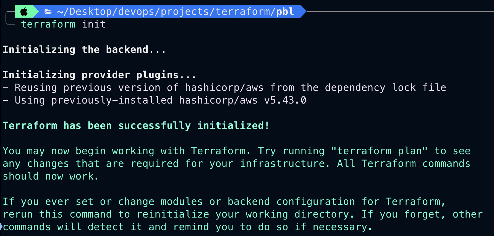

# Automating Infrastructure Creation With IAC (Terraform)


- Create an IAM user, name it terraform (ensure that the user has only programatic access to your AWS account) and grant this user AdministratorAccess permissions.

- Copy the secret access key and access key ID. Save them in a notepad temporarily.

If you have the AWS CLI installed, then you can use the aws configure command to configure your credentials file:

```
aws configure
```

# VPC | SUBNETS | SECURITY GROUPS

Let us create a directory structure

Open your Visual Studio Code and:

- Create a folder called `PBL`
- Create a file in the folder, name it `main.tf`

# Provider and VPC resource section

- Set up Terraform CLI.

- Add `AWS` as a provider, and a resource to create a VPC in the `main.tf` file.

- Provider block informs Terraform that we intend to build infrastructure within AWS.

- Resource block will create a VPC.

```
provider "aws" {
  region = "eu-west-2"
}

# Create VPC
resource "aws_vpc" "main" {
  cidr_block                     = "172.16.0.0/16"
  enable_dns_support             = "true"
  enable_dns_hostnames           = "true"
}
```

- The next thing we need to do, is to download necessary plugins for Terraform to work. These plugins are used by `providers` and `provisioners`. At this stage, we only have `provider` in our `main.tf` file. So, Terraform will just download plugin for AWS provider.

- Run the below command
```
terraform init
```



- Notice that a new directory has been created: .`terraform\...`. This is where Terraform keeps plugins. Generally, it is safe to delete this folder. It just means that you must execute terraform init again, to download them.
- Moving on, let us create the only resource we just defined `aws_vpc`. But before we do that, we should check to see what terraform intends to create before we tell it to go ahead and create it.

- Run `terraform plan`
- Then, if you are happy with changes planned, execute `terraform apply`


1. A new file is created `terraform.tfstate`. This is how Terraform keeps itself up to date with the exact state of the infrastructure. It reads this file to know what already exists, what should be added, or destroyed based on the entire terraform code that is being developed.
2. If you also observed closely, you would realise that another file gets created during planning and apply. But this file gets deleted immediately `terraform.tfstate.lock.info` .This is what Terraform uses to track, who is running its code against the infrastructure at any point in time. This is very important for teams working on the same Terraform repository at the same time. The lock prevents a user from executing Terraform configuration against the same infrastructure when another user is doing the same - it allows to avoid duplicates and conflicts.

## Subnets resource section
#

According to our architectural design, we require 6 subnets:

- 2 public
- 2 private for webservers
- 2 private for data layer
  
Let us create the first 2 public subnets.

Add below configuration to the main.tf file:

```
# Create public subnet1
    resource "aws_subnet" "public1" {
    vpc_id                     = aws_vpc.main.id
    cidr_block                 = "172.16.0.0/24"
    map_public_ip_on_launch    = true
    availability_zone          = "eu-west-2a"

}

# Create public subnet2
    resource "aws_subnet" "public2" {
    vpc_id                     = aws_vpc.main.id
    cidr_block                 = "172.16.1.0/24"
    map_public_ip_on_launch    = true
    availability_zone          = "eu-west-2b"
}
```

- We are creating 2 subnets, therefore declaring 2 resource blocks - one for each of the subnets.
- We are using the `vpc_id` argument to interpolate the value of the VPC id by setting it to aws_vpc.main.id. This way, Terraform knows inside which VPC to create the subnet.

Run `terraform plan` and `terraform apply`.

**Observations:**

- `Hard coded values`: Remember our best practice hint from the beginning? Both the `availability_zone` and `cidr_block` arguments are hard coded. We should always endeavour to make our work dynamic.
- `Multiple Resource Blocks`: Notice that we have declared multiple resource blocks for each subnet in the code. This is bad coding practice. We need to create a single resource block that can dynamically create resources without specifying multiple blocks. Imagine if we wanted to create 10 subnets, our code would look very clumsy. So, we need to optimize this by introducing a `count argument`.

Now let us improve our code by refactoring it.

First, destroy the current infrastructure. Since we are still in development, this is totally fine. Otherwise, `DO NOT DESTROY` an infrastructure that has been deployed to production.

To destroy whatever has been created run `terraform destroy` command, and type `yes` after evaluating the plan.

# FIXING THE PROBLEMS BY CODE REFACTORING

Starting with the provider block, declare a variable named region, give it a default value, and update the provider section by referring to the declared variable.

- `Fixing Hard Coded Values`: We will introduce `variables`, and remove hard coding.

- Starting with the `provider block`, declare a variable named `region`, give it a default value, and update the provider section by referring to the declared variable.
```
    variable "region" {
        default = "eu-west-2"
    }

    provider "aws" {
        region = var.region
    }

    variable "vpc_cidr" {
        default = "172.16.0.0/16"
    }

    variable "enable_dns_support" {
        default = "true"
    }

    variable "enable_dns_hostnames" {
        default ="true" 
    }

    provider "aws" {
    region = var.region
    }

    # Create VPC
    resource "aws_vpc" "main" {
    cidr_block                     = var.vpc_cidr
    enable_dns_support             = var.enable_dns_support 
    enable_dns_hostnames           = var.enable_dns_support
    }
```

- `Fixing multiple resource blocks`: This is where things become a little tricky. It's not complex, we are just going to introduce some interesting concepts. `Loops & Data sources`.

Terraform has a functionality that allows us to pull data which exposes information to us. For example, every region has `Availability Zones (AZ)`. Different regions have from 2 to 4 Availability Zones. With over 20 geographic regions and over 70 AZs served by AWS, it is impossible to keep up with the latest information by hard coding the names of AZs. Hence, we will explore the use of Terraform's `Data Sources` to fetch information outside of Terraform. In this case, from `AWS`.

- Get list of availability zones
```
data "aws_availability_zones" "available" {
  state = "available"
}
```
To make use of this new `data resource`, we will need to introduce a `count` argument in the subnet block: Something like this.
- Create public subnet
```
    resource "aws_subnet" "public" { 
        count                   = 2
        vpc_id                  = aws_vpc.main.id
        cidr_block              = "172.16.1.0/24"
        map_public_ip_on_launch = true
        availability_zone       = data.aws_availability_zones.available.names[count.index]
    }
```

To understand what is going on:
- The `count` tells us that we need 2 subnets. Therefore, Terraform will invoke a loop to create 2 subnets.
- The `data resource` will return a list object that contains a list of AZs. Internally, Terraform will receive the data like this:
```
  ["eu-west-2a", "eu-west-2b"]
```
Each of them is an index, the first one is `index 0`, while the other is `index 1`. If the data returned had more than 2 records, then the index numbers would continue to increment.

Therefore, each time Terraform goes into a loop to create a subnet, it must be created in the retrieved AZ from the list. Each loop will need the index number to determine what AZ the subnet will be created. That is why we have `data.aws_availability_zones.available.names[count.index]` as the value for `availability_zone`. When the first loop runs, the first index will be 0, therefore the AZ will be eu-west-2a. The pattern will repeat for the second loop.

But we still have a problem. If we run Terraform with this configuration, it may succeed for the first time, but by the time it goes into the second loop, it will fail because we still have `cidr_block` hard coded. The same `cidr_block` cannot be created twice within the same VPC. So, we have a little more work to do.

We will introduce a function `cidrsubnet()` to make this happen. It accepts 3 parameters.
```
    # Create public subnet
    resource "aws_subnet" "public" { 
        count                   = 2
        vpc_id                  = aws_vpc.main.id
        cidr_block              = cidrsubnet(var.vpc_cidr, 4 , count.index)
        map_public_ip_on_launch = true
        availability_zone       = data.aws_availability_zones.available.names[count.index]
    }
```
We can introuduce `length() function`, which basically determines the length of a given list, map, or string.

Since `data.aws_availability_zones.available.names` returns a list like ["eu-west-2a", "eu-west-2b", "eu-west-2c"] we can pass it into a lenght function and get number of the AZs.

Now we can simply update the public subnet block like this:
```
# Create public subnet
resource "aws_subnet" "public" { 
    count                   = length(data.aws_availability_zones.available.names)
    vpc_id                  = aws_vpc.main.id
    cidr_block              = cidrsubnet(var.vpc_cidr, 4 , count.index)
    map_public_ip_on_launch = true
    availability_zone       = data.aws_availability_zones.available.names[count.index]
}
```
**Observations:**

- What we have now, is sufficient to create the subnet resource required. But if you observe, it is not satisfying our business requirement of just 2 subnets. The `length function` will return number 3 to the `count argument`, but what we actually need is `2`.

Now, let us fix this.

- Declare a variable to store the desired number of public subnets, and set the default value.
```
  variable "preferred_number_of_public_subnets" {
      default = 2
}
```
- Next, update the `count argument` with a condition. Terraform needs to check first if there is a desired number of subnets. Otherwise, use the data returned by the `lenght function`. See how that is presented below.
```
# Create public subnets
resource "aws_subnet" "public" {
  count  = var.preferred_number_of_public_subnets == null ? length(data.aws_availability_zones.available.names) : var.preferred_number_of_public_subnets   
  vpc_id = aws_vpc.main.id
  cidr_block              = cidrsubnet(var.vpc_cidr, 4 , count.index)
  map_public_ip_on_launch = true
  availability_zone       = data.aws_availability_zones.available.names[count.index]
}
```
Now lets break it down:

- The first part `var.preferred_number_of_public_subnets == null` checks if the value of the variable is set to `null` or has some value defined.
- The second part `? and length(data.aws_availability_zones.available.names)` means, if the first part is true, then use this. In other words, if preferred number of public subnets is null (Or not known) then set the value to the data returned by `lenght function`.
- The third part `: var.preferred_number_of_public_subnets` means, if the first condition is false, i.e preferred number of public subnets is not null then set the value to whatever is definied in `var.preferred_number_of_public_subnets`

Now the entire configuration should now look like this:
```
# Get list of availability zones
data "aws_availability_zones" "available" {
  state = "available"
}

variable "region" {
  default = "eu-west-2"
}

variable "vpc_cidr" {
  default = "172.16.0.0/16"
}

variable "enable_dns_support" {
  default = "true"
}

variable "enable_dns_hostnames" {
  default = "true"
}

variable "preferred_number_of_public_subnets" {
  default = 2
}

provider "aws" {
  region = var.region
}

# Create VPC
resource "aws_vpc" "main" {
  cidr_block           = var.vpc_cidr
  enable_dns_support   = var.enable_dns_support
  enable_dns_hostnames = var.enable_dns_support
}

# Create public subnets
resource "aws_subnet" "public" {
  count                   = var.preferred_number_of_public_subnets == null ? length(data.aws_availability_zones.available.names) : var.preferred_number_of_public_subnets
  vpc_id                  = aws_vpc.main.id
  cidr_block              = cidrsubnet(var.vpc_cidr, 4, count.index)
  map_public_ip_on_launch = true
  availability_zone       = data.aws_availability_zones.available.names[count.index]
}
```
